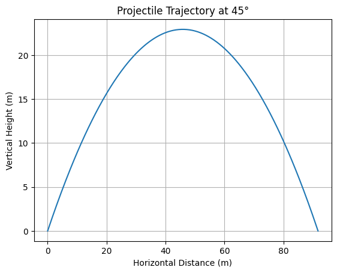
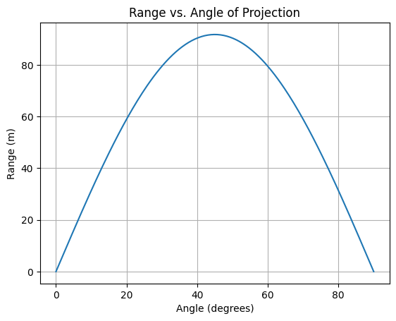
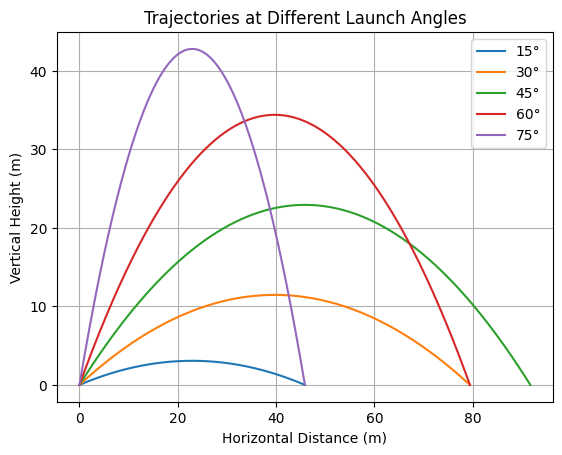
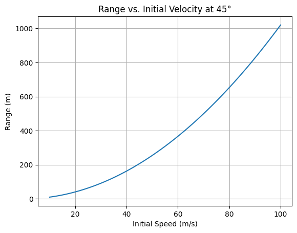

Exploring the Central Limit Theorem through simulations

Motivation:¶
The Central Limit Theorem (CLT) is a cornerstone of probability and statistics, stating that the sampling distribution of the sample mean approaches a normal distribution as the sample size increases, regardless of the population’s original distribution. Simulations provide an intuitive and hands-on way to observe this phenomenon in action.

Task:¶
1 Simulating Sampling Distributions:

Select several types of population distributions, such as:
Uniform distribution.
Exponential distribution.
Binomial distribution.
For each distribution, generate a large dataset representing the population.
2 Sampling and Visualization:

Randomly sample data from the population and calculate the sample mean for different sample sizes (e.g., 5, 10, 30, 50).
Repeat the process multiple times to create a sampling distribution of the sample mean.
Plot histograms of the sample means for each sample size and observe the convergence to a normal distribution.
3 Parameter Exploration:

Investigate how the shape of the original distribution and the sample size influence the rate of convergence to normality.
Highlight the impact of the population’s variance on the spread of the sampling distribution.
4 Practical Applications:

Reflect on the importance of the CLT in real-world scenarios, such as:
Estimating population parameters.
Quality control in manufacturing.
Predicting outcomes in financial models.

# 1. Theoretical Foundation

Projectile motion is a classical physics problem that can be fully described using Newton’s laws of motion and the kinematic equations. In this section, we will derive the governing equations, define key variables, and discuss the structural independence of horizontal and vertical components of the motion.

---

## 1.1 Governing Equations of Motion

Assume a particle is projected from an initial height $h_0$ with an initial velocity $v_0$ at an angle $\theta$ above the horizontal. We ignore air resistance for simplicity.

We resolve the motion into two orthogonal components:

- Horizontal (x-axis)
- Vertical (y-axis)

Using kinematics:

**Horizontal Motion:**
- Constant velocity motion (no horizontal acceleration)
  
  $$
  x(t) = v_0 \cos(\theta) \cdot t
  $$

**Vertical Motion:**
- Accelerated motion due to gravity
  
  $$
  y(t) = h_0 + v_0 \sin(\theta) \cdot t - \frac{1}{2} g t^2
  $$

where:
- $x(t)$ and $y(t)$ are positions as functions of time $t$
- $g$ is the acceleration due to gravity (typically $9.81 \, \text{m/s}^2$)

---

## 1.2 Key Variables

- $\theta$: Angle of projection (radians or degrees)
- $v_0$: Initial velocity (magnitude)
- $g$: Acceleration due to gravity ($9.81 \, \text{m/s}^2$ on Earth)
- $h_0$: Initial height from which the projectile is launched
- $t$: Time variable (s)
- $x(t), y(t)$: Horizontal and vertical displacements as functions of time

---

## 1.3 Independence of Motion Components

According to Newton’s Second Law, motion along perpendicular axes is **independent**:

- Horizontal motion is **uniform** (no acceleration).
- Vertical motion is **uniformly accelerated** (due to gravity).

This allows the problem to be **decoupled** into two separate 1D problems.

---

## 1.4 Range as a Function of Angle

The **horizontal range** $R$ is the horizontal distance traveled when the projectile returns to the ground ($y = 0$).

For a flat surface ($h_0 = 0$), set $y(t) = 0$:

$$
0 = v_0 \sin(\theta) \cdot t - \frac{1}{2} g t^2
$$

Solving for time of flight $T$ (non-zero solution):

$$
T = \frac{2 v_0 \sin(\theta)}{g}
$$

Substitute into horizontal displacement:

$$
R = x(T) = v_0 \cos(\theta) \cdot T = \frac{v_0^2 \sin(2\theta)}{g}
$$

Thus, the range depends on:

- Square of initial speed $v_0$
- Sine of double the angle $\sin(2\theta)$
- Inversely on gravity $g$

---

## 1.5 Symmetry in Motion

In the absence of air resistance and with $h_0 = 0$, projectile motion exhibits **time-reversal symmetry**:

- The trajectory is a parabola symmetric about the apex.
- The time to reach maximum height equals the time to descend from it.

Mathematically:
- The height at time $t$ equals the height at time $T - t$
- Maximum range occurs at $\theta = 45^\circ$ since $\sin(2\theta)$ is maximal when $2\theta = 90^\circ$

---

## 1.6 Simplifying Assumptions

To isolate the core physics:

- No air resistance (ideal projectile)
- Constant gravitational acceleration
- Flat launch and landing surfaces
- Rigid-body approximation (treat the projectile as a point mass)

These assumptions allow analytical solutions and illustrate core physical principles. For real-world modeling, corrections may be introduced.

---


# 2. Analytical Range Dependency

In this section, we analyze the mathematical structure of the horizontal range of projectile motion as a function of various parameters: launch angle, initial velocity, gravitational acceleration, and launch height. We begin with the canonical case of a ground-level launch, then extend to arbitrary launch heights and perform sensitivity analysis.

---

## 2.1 Range Equation — Ground-Level Launch

Assuming the projectile is launched from and lands on the same horizontal level ($h_0 = 0$), the time of flight $T$ is derived from setting vertical displacement to zero:

$$
y(t) = v_0 \sin(\theta) \cdot t - \frac{1}{2} g t^2 = 0
$$

Ignoring the trivial solution $t = 0$, the total time of flight is:

$$
T = \frac{2 v_0 \sin(\theta)}{g}
$$

Substituting into the horizontal position:

$$
R = x(T) = v_0 \cos(\theta) \cdot T
$$

Therefore, the **horizontal range** is:

$$
R = \frac{v_0^2 \sin(2\theta)}{g}
$$

---

## 2.2 Extension to Non-Zero Launch Height

Now consider the projectile launched from a height $h_0 > 0$.

The vertical displacement is:

$$
y(t) = h_0 + v_0 \sin(\theta) \cdot t - \frac{1}{2} g t^2
$$

Set $y(t) = 0$ and solve the quadratic:

$$
0 = h_0 + v_0 \sin(\theta) \cdot t - \frac{1}{2} g t^2
$$

Using the quadratic formula:

$$
t = \frac{v_0 \sin(\theta) + \sqrt{(v_0 \sin(\theta))^2 + 2 g h_0}}{g}
$$

Then, the range becomes:

$$
R = v_0 \cos(\theta) \cdot \left( \frac{v_0 \sin(\theta) + \sqrt{(v_0 \sin(\theta))^2 + 2 g h_0}}{g} \right)
$$

This formula accounts for the increased time aloft due to the launch height $h_0$.

---

## 2.3 Range vs. Angle — Maximum Range Angle

In the ground-level case, since:

$$
R = \frac{v_0^2 \sin(2\theta)}{g}
$$

The maximum value of $\sin(2\theta)$ occurs when:

$$
2\theta = 90^\circ \Rightarrow \theta = 45^\circ
$$

So the maximum range for a flat launch occurs at **$\theta = 45^\circ$**.

For non-zero $h_0$, the optimal angle **shifts** slightly downward, and must be found numerically or via calculus optimization.

---

## 2.4 Sensitivity Analysis

We now consider how the range $R$ responds to changes in key parameters.

---

### ➤ Sensitivity to Angle ($\theta$)

In the ground-level case:

$$
R(\theta) = \frac{v_0^2 \sin(2\theta)}{g}
$$

- **Highly nonlinear** dependence due to sine function.
- **Symmetry:** $R(\theta) = R(90^\circ - \theta)$.
- Range is sensitive near $\theta = 45^\circ$ (small changes can cause noticeable deviation).

---

### ➤ Sensitivity to Initial Velocity ($v_0$)

Since:

$$
R \propto v_0^2
$$

- **Quadratic growth** in range with velocity.
- Doubling $v_0$ results in a **fourfold** increase in range (if angle and $g$ remain fixed).

---

### ➤ Sensitivity to Gravity ($g$)

Again from:

$$
R \propto \frac{1}{g}
$$

- **Inversely proportional**: Higher gravity leads to shorter range.
- E.g., on the Moon ($g \approx 1.63 \, \text{m/s}^2$), projectiles travel **farther** than on Earth.

---

### ➤ Combined Dependencies

Overall, the range is governed by:

$$
R = \frac{v_0^2 \sin(2\theta)}{g} \quad \text{(for } h_0 = 0\text{)}
$$

And is **nonlinear** with respect to:
- Angle $\theta$ (trigonometric dependency)
- Velocity $v_0$ (quadratic)
- Gravity $g$ (reciprocal)

---

## 2.5 Summary

- The classical range equation provides insight into how projectiles behave under ideal conditions.
- Extensions to non-zero heights introduce asymmetry and more complex dynamics.
- Sensitivity to initial conditions emphasizes the need for precision in real-world applications like sports or engineering.

---

# 3. Practical Applications

While the idealized model of projectile motion is useful for conceptual understanding, its application in the real world requires adjustments for various non-ideal conditions. This section explores practical scenarios and the modifications needed to extend the basic equations of motion.

---

## 3.1 Real-World Scenarios

Projectile motion underpins many fields in science, engineering, and everyday life. Examples include:

- **Sports:** 
  - Soccer, basketball, golf — predicting the arc of a kicked or thrown ball.
  - Optimizing angle and speed for maximum distance or accuracy.

- **Ballistics:**
  - Firearms and artillery — range, angle, and impact prediction.
  - Military targeting systems rely on modified projectile models.

- **Aerospace:**
  - Rocket launches, space re-entry paths.
  - Orbital mechanics incorporates gravitational variation and drag.

- **Engineering:**
  - Water jets in fountains.
  - Debris trajectory analysis for structural safety.

---

## 3.2 Non-Ideal Conditions

### ➤ Air Resistance

Air resistance (drag) introduces a **velocity-dependent** force, typically modeled as:

$$
\vec{F}_d = -\frac{1}{2} C_d \rho A v^2 \hat{v}
$$

where:
- $C_d$: Drag coefficient (depends on shape and surface)
- $\rho$: Air density
- $A$: Cross-sectional area
- $v$: Velocity magnitude
- $\hat{v}$: Unit vector in the direction of motion

**Effects:**
- Reduces horizontal range.
- Breaks time symmetry.
- Requires **numerical methods** to solve differential equations of motion.

---

### ➤ Wind

Wind adds a **constant or variable velocity component** to the system:

- Headwind decreases effective horizontal velocity.
- Tailwind increases it.
- Crosswinds alter lateral displacement (especially important in ballistics).

Wind forces are often modeled as:

$$
\vec{F}_{\text{wind}} = m \vec{a}_{\text{wind}}
$$

Where $\vec{a}_{\text{wind}}$ is an external acceleration due to wind influence.

---

### ➤ Launch from/onto a Slope

For inclined surfaces, the coordinate axes must be **rotated** to align with the slope.

- Let the incline angle be $\phi$.
- Adjust equations to project velocity components along and perpendicular to the slope:

  $$
  v_{x'} = v_0 \cos(\theta - \phi), \quad v_{y'} = v_0 \sin(\theta - \phi)
  $$

- Gravity also decomposes accordingly:

  $$
  g_{x'} = g \sin(\phi), \quad g_{y'} = g \cos(\phi)
  $$

**Result:**
- More complex motion.
- Landing point must be calculated by solving in a rotated frame.

---

## 3.3 Modifications to the Basic Model

To adapt the projectile model to these practical scenarios, several modifications are typically introduced:

| Condition         | Modification Required                        | Solution Method      |
|------------------|-----------------------------------------------|----------------------|
| Air Resistance    | Add quadratic or linear drag terms to force  | Numerical (e.g., Runge-Kutta) |
| Wind              | Modify net velocity and external forces      | Analytic + numeric  |
| Uneven Terrain    | Adjust coordinate system and boundaries      | Trigonometric projection |
| Variable Gravity  | Use $g(h)$ decreasing with altitude          | Calculus-based modeling |
| Coriolis Effect   | Add Earth-rotation corrections               | Used in long-range targeting |

---

## 3.4 Summary

Real-world projectile motion is influenced by multiple external forces and geometric considerations. While the basic model offers insight, high-accuracy predictions require:

- Realistic force modeling
- Coordinate transformations
- Computational techniques

The flexibility of the core equations allows for layered complexity without losing foundational clarity.


---

# 4. Computational Simulation and Visualization

## ✅ 1. **Basic Trajectory Simulation (Single Launch)**

Simulates and plots the trajectory for a given angle, velocity, and height.

```python
import numpy as np
import matplotlib.pyplot as plt

# Parameters
v0 = 30  # initial speed (m/s)
theta_deg = 45  # launch angle (degrees)
h0 = 0  # initial height (m)
g = 9.81  # gravity (m/s²)

# Convert to radians
theta = np.radians(theta_deg)

# Time of flight
t_flight = (v0 * np.sin(theta) + np.sqrt((v0 * np.sin(theta))**2 + 2 * g * h0)) / g
t = np.linspace(0, t_flight, num=300)

# Trajectory equations
x = v0 * np.cos(theta) * t
y = h0 + v0 * np.sin(theta) * t - 0.5 * g * t**2

# Plot
plt.figure()
plt.plot(x, y)
plt.title(f"Projectile Trajectory at {theta_deg}°")
plt.xlabel("Horizontal Distance (m)")
plt.ylabel("Vertical Height (m)")
plt.grid(True)
plt.show()
```


---

## ✅ 2. **Range vs. Angle Curve**

Plots the horizontal range as a function of angle for a flat surface (\$h\_0 = 0\$).

```python
angles_deg = np.linspace(0, 90, 200)
v0 = 30
g = 9.81

ranges = (v0**2) * np.sin(2 * np.radians(angles_deg)) / g

plt.figure()
plt.plot(angles_deg, ranges)
plt.title("Range vs. Angle of Projection")
plt.xlabel("Angle (degrees)")
plt.ylabel("Range (m)")
plt.grid(True)
plt.show()
```


---

## ✅ 3. **Overlay of Multiple Trajectories (Different Angles)**

Visualizes how the angle affects the shape and range of the trajectory.

```python
angles_deg = [15, 30, 45, 60, 75]
v0 = 30
h0 = 0
g = 9.81

plt.figure()
for angle in angles_deg:
    theta = np.radians(angle)
    t_flight = (2 * v0 * np.sin(theta)) / g
    t = np.linspace(0, t_flight, num=300)
    x = v0 * np.cos(theta) * t
    y = v0 * np.sin(theta) * t - 0.5 * g * t**2
    plt.plot(x, y, label=f"{angle}°")

plt.title("Trajectories at Different Launch Angles")
plt.xlabel("Horizontal Distance (m)")
plt.ylabel("Vertical Height (m)")
plt.legend()
plt.grid(True)
plt.show()
```


---

## ✅ 4. **Effect of Initial Velocity on Range**

Plots how range varies with increasing speed at a fixed angle.

```python
v0_values = np.linspace(10, 100, 100)
theta = np.radians(45)
g = 9.81

ranges = (v0_values**2) * np.sin(2 * theta) / g

plt.figure()
plt.plot(v0_values, ranges)
plt.title("Range vs. Initial Velocity at 45°")
plt.xlabel("Initial Speed (m/s)")
plt.ylabel("Range (m)")
plt.grid(True)
plt.show()
```

