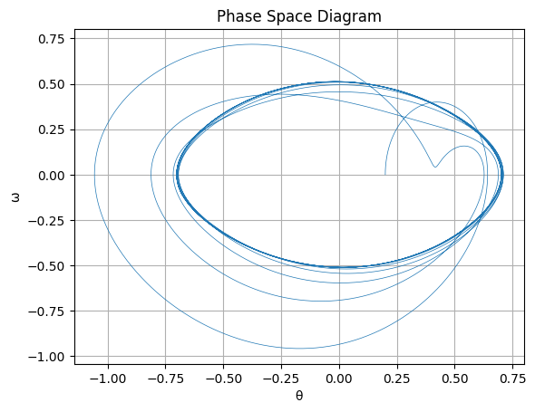

# Problem 2
# 1. Theoretical Foundation

## Governing Differential Equation

The equation of motion for a **forced damped pendulum** is derived from Newton's second law or the torque equation. It accounts for three forces: restoring torque, damping torque, and external driving torque. The governing equation is:

$$
\frac{d^2\theta}{dt^2} + \gamma \frac{d\theta}{dt} + \omega_0^2 \sin(\theta) = A \cos(\omega t)
$$

Where:
- $\theta(t)$ is the angular displacement,
- $\gamma$ is the damping coefficient,
- $\omega_0 = \sqrt{\frac{g}{l}}$ is the natural frequency of the undamped pendulum,
- $A$ is the amplitude of the external periodic driving force,
- $\omega$ is the driving frequency.

## Linearization for Small-Angle Approximations

For small angular displacements, $\theta \ll 1$, the sine function can be approximated by its Taylor expansion:

$$
\sin(\theta) \approx \theta
$$

Thus, the linearized equation becomes:

$$
\frac{d^2\theta}{dt^2} + \gamma \frac{d\theta}{dt} + \omega_0^2 \theta = A \cos(\omega t)
$$

This is the standard form of a **driven damped harmonic oscillator**.

## Analytical Solution of the Linearized System

We consider the general solution as a sum of the **homogeneous** and **particular** solutions:

### Homogeneous Solution:
Solve:
$$
\frac{d^2\theta}{dt^2} + \gamma \frac{d\theta}{dt} + \omega_0^2 \theta = 0
$$

The characteristic equation is:
$$
r^2 + \gamma r + \omega_0^2 = 0
$$

Its solution depends on the discriminant $\Delta = \gamma^2 - 4\omega_0^2$:
- **Underdamped** ($\gamma^2 < 4\omega_0^2$): Oscillatory decay
- **Critically damped** ($\gamma^2 = 4\omega_0^2$): Fastest return to equilibrium without oscillation
- **Overdamped** ($\gamma^2 > 4\omega_0^2$): Slow non-oscillatory return

### Particular Solution:
Assume a solution of the form:
$$
\theta_p(t) = B \cos(\omega t - \delta)
$$

Substitute into the linearized equation and solve for amplitude $B$ and phase lag $\delta$:
$$
B = \frac{A}{\sqrt{(\omega_0^2 - \omega^2)^2 + \gamma^2 \omega^2}}, \quad \tan(\delta) = \frac{\gamma \omega}{\omega_0^2 - \omega^2}
$$

## Natural Frequency (Undamped, Unforced System)

For the simple pendulum with no damping or driving force:
$$
\frac{d^2\theta}{dt^2} + \omega_0^2 \theta = 0
$$

This is a second-order linear ODE with the solution:
$$
\theta(t) = \theta_0 \cos(\omega_0 t + \phi)
$$

Where:
- $\omega_0 = \sqrt{\frac{g}{l}}$ is the **natural frequency**,
- $\theta_0$ is the initial amplitude,
- $\phi$ is the initial phase.

## Resonance Conditions

**Resonance** occurs when the driving frequency $\omega$ approaches the natural frequency $\omega_0$ of the system. In the absence of damping ($\gamma = 0$), the amplitude becomes:

$$
B \rightarrow \infty \quad \text{as} \quad \omega \to \omega_0
$$

With damping, resonance occurs at:

$$
\omega_{\text{res}} = \sqrt{\omega_0^2 - \frac{\gamma^2}{2}}
$$

## Energy Transfer under Resonance

At resonance, the **energy input** from the driving force is maximized. Energy is transferred into the system constructively, increasing the oscillation amplitude.

The instantaneous power delivered by the driving force is:

$$
P(t) = \tau_{\text{drive}} \cdot \frac{d\theta}{dt} = A \cos(\omega t) \cdot \frac{d\theta}{dt}
$$

The average power over one cycle is maximized when $\omega \approx \omega_{\text{res}}$, indicating efficient energy absorption and larger oscillations.

---
# 2. Analysis of Dynamics

## 2.1 Effect of Damping ($\gamma$)

The damping coefficient $\gamma$ controls the rate of energy loss in the system. Depending on the value of $\gamma$, the system exhibits three distinct regimes in the absence of driving force ($A = 0$):

### Underdamped ($\gamma^2 < 4\omega_0^2$)
- The system oscillates with gradually decreasing amplitude.
- The solution takes the form:
  $$
  \theta(t) = e^{-\frac{\gamma}{2} t} \left( C_1 \cos(\omega_d t) + C_2 \sin(\omega_d t) \right)
  $$
  Where $\omega_d = \sqrt{\omega_0^2 - \frac{\gamma^2}{4}}$ is the damped natural frequency.

### Critically Damped ($\gamma^2 = 4\omega_0^2$)
- The system returns to equilibrium as fast as possible without oscillating.
- General solution:
  $$
  \theta(t) = (C_1 + C_2 t)e^{-\frac{\gamma}{2} t}
  $$

### Overdamped ($\gamma^2 > 4\omega_0^2$)
- No oscillations occur; the system returns to equilibrium slowly.
- The response is governed by two distinct exponential decays.

## 2.2 Varying Driving Amplitude ($A$)

The **driving amplitude** determines the energy supplied to the system. As $A$ increases:

- The **steady-state amplitude** of oscillation increases.
- At large $A$, the **nonlinear nature** of the sine term becomes prominent, leading to:
  - Asymmetric oscillations
  - Sudden jumps in amplitude (discontinuities in response curves)
  - **Bifurcations**, where the system transitions between different oscillatory modes

This nonlinear response can be visualized with **bifurcation diagrams** where $\theta$ (or $\dot{\theta}$) is plotted against $A$.

## 2.3 Varying Driving Frequency ($\omega$)

When scanning across a range of driving frequencies $\omega$ for a fixed amplitude:

- The system exhibits **resonance behavior**, peaking at or near $\omega_0$.
- The **resonance curve** shows the response amplitude $B$ as a function of $\omega$:
  $$
  B(\omega) = \frac{A}{\sqrt{(\omega_0^2 - \omega^2)^2 + \gamma^2 \omega^2}}
  $$

- In nonlinear systems, this curve becomes asymmetric and may exhibit **hysteresis**.

## 2.4 Identifying Conditions for Chaos

As both $A$ and $\omega$ increase, the forced damped pendulum can enter **chaotic regimes**.

### Diagnostic Tools:
- **Lyapunov Exponents**: A positive largest Lyapunov exponent ($\lambda > 0$) indicates sensitivity to initial conditions—a hallmark of chaos.
- **Bifurcation Diagrams**: Show qualitative changes in the structure of solutions as a parameter (e.g., $A$ or $\omega$) varies.
- **Poincaré Sections**: A stroboscopic map sampled once per drive cycle. A single point indicates periodic motion; a fractal structure indicates chaos.

## 2.5 Quasiperiodic and Chaotic Regimes

### Quasiperiodic Motion:
- Involves two incommensurate frequencies.
- Phase space trajectories form **tori**.
- Poincaré section: closed curves.

### Chaotic Motion:
- Aperiodic and highly sensitive to initial conditions.
- Phase space trajectory fills a **strange attractor**.
- Poincaré section: scattered points forming a fractal structure.

Visualization of both regimes helps to contrast ordered vs. disordered dynamics. Examples include:

- **Time series**: Smooth and repeating vs. irregular and erratic.
- **Phase diagrams**: Closed loops vs. tangled trajectories.

## 2.6 Stability of Fixed Points and Limit Cycles

To assess the **stability** of equilibria and periodic orbits:

### Linear Stability Analysis:
Linearize around a fixed point or trajectory:
$$
\theta'' + \gamma \theta' + f(\theta) = 0
$$
Compute eigenvalues of the Jacobian matrix. If all have negative real parts, the fixed point is stable.

### Floquet Theory:
Used for **periodic solutions**. Determines the stability of limit cycles by examining the monodromy matrix:
- If all Floquet multipliers have magnitude < 1: the cycle is stable.
- If any multiplier > 1: the cycle is unstable.

---

This analytical toolkit enables a comprehensive understanding of the pendulum's dynamic behavior across parameter regimes.
# 3. Practical Applications

The forced damped pendulum serves as a versatile analog for many **real-world systems** governed by similar nonlinear dynamics, especially those involving periodic driving and energy dissipation.

## 3.1 Real-World Analogues of the Forced Damped Pendulum

Several physical systems can be **modeled** or **approximated** by the dynamics of a forced damped pendulum:

### A. Suspension Bridges

- Example: **Tacoma Narrows Bridge (1940 collapse)**.
- The bridge deck behaved like a driven oscillator, responding to periodic wind forces.
- Self-excited oscillations and **aerodynamically driven resonance** resulted in torsional instability and eventual structural failure.
- Model Mapping:
  - Angular displacement $\theta(t) \leftrightarrow$ torsional deflection of the bridge.
  - Driving force $A \cos(\omega t) \leftrightarrow$ periodic wind gusts or vortex shedding.
  - Damping $\gamma \leftrightarrow$ internal and aerodynamic damping.

### B. Piezoelectric Energy Harvesters

- These devices convert mechanical vibrations into electrical energy.
- Typically modeled as a **damped driven cantilever beam**, which behaves similarly to a pendulum.
- Optimal energy transfer occurs at or near the resonant frequency.

- Key Model Parameters:
  - $\omega_0$ matches the structure’s natural frequency.
  - $A$ corresponds to ambient vibration amplitude.
  - $\gamma$ accounts for mechanical and electrical energy losses.

### C. Electronic RLC Circuits Under AC Drive

- The behavior of a **resistor-inductor-capacitor (RLC)** circuit driven by an AC source is mathematically identical to the linearized forced damped pendulum.

#### Governing Equation for RLC Circuit:
$$
L \frac{d^2Q}{dt^2} + R \frac{dQ}{dt} + \frac{Q}{C} = V_0 \cos(\omega t)
$$

- Map to pendulum model:
  - $Q(t) \leftrightarrow \theta(t)$ (charge analogous to angular displacement),
  - $R \leftrightarrow \gamma$ (resistance as damping),
  - $1/\sqrt{LC} \leftrightarrow \omega_0$ (resonant frequency).

- Important insight: **Signal clarity and selectivity** in RLC filters depend on the damping and proximity to resonance.

## 3.2 Engineering Considerations

### A. Resonance

- Systems operating near resonance can exhibit **large-amplitude oscillations**:
  - In bridges → destructive structural vibration.
  - In circuits → signal amplification or filtering.
  - In energy harvesters → optimal power output.

- Engineers must:
  - Design systems to **avoid unwanted resonance** (e.g., bridge design, building sway),
  - Or **exploit resonance safely** (e.g., vibration-based energy harvesting).

### B. Chaos

- In mechanical or electrical systems, chaotic behavior implies **extreme sensitivity to initial conditions** and **unpredictable response**.
- Can lead to:
  - Mechanical failure,
  - Signal distortion or noise in electronic circuits,
  - Instability in feedback control systems.

- Design strategies involve:
  - **Damping augmentation** to suppress chaotic regions,
  - **Parameter tuning** to confine systems within stable regimes.

### C. Efficiency and Stability

- Maximizing energy transfer or maintaining control requires:
  - **Precise tuning** of system parameters ($\omega$, $A$, $\gamma$),
  - Careful balancing between **energy input and dissipation**,
  - Robust system architecture that can withstand unexpected transitions.

---

These practical mappings highlight the universality of the forced damped pendulum model and its relevance across structural, mechanical, and electrical engineering domains.

# 4. Computational Simulation and Visualization

## 1. Numerical Solver (Nonlinear Pendulum, Runge-Kutta)

```python
import numpy as np
from scipy.integrate import solve_ivp

# Nonlinear forced damped pendulum
def pendulum(t, y, gamma, omega0, A, omega_drive):
    theta, omega = y
    dtheta_dt = omega
    domega_dt = -gamma * omega - omega0**2 * np.sin(theta) + A * np.cos(omega_drive * t)
    return [dtheta_dt, domega_dt]

# Parameters
gamma = 0.2
omega0 = 1.5
A = 1.2
omega_drive = 2/3
y0 = [0.2, 0]  # Initial conditions: [theta, omega]
t_span = (0, 100)
t_eval = np.linspace(*t_span, 10000)

sol = solve_ivp(pendulum, t_span, y0, args=(gamma, omega0, A, omega_drive), t_eval=t_eval)

```

## 2. Time Series Plot (Angular Displacement and Velocity)

```python
import matplotlib.pyplot as plt

plt.figure()
plt.plot(sol.t, sol.y[0], label='θ(t)')
plt.plot(sol.t, sol.y[1], label='ω(t)', alpha=0.7)
plt.xlabel('Time')
plt.ylabel('Amplitude')
plt.title('Time Series of θ and ω')
plt.legend()
plt.grid(True)
plt.show()
```


## 3. Phase Space Diagram (θ vs. ω)

```python
plt.figure()
plt.plot(sol.y[0], sol.y[1], lw=0.5)
plt.xlabel('θ')
plt.ylabel('ω')
plt.title('Phase Space Diagram')
plt.grid(True)
plt.show()
```



## 4. Poincaré Section (Stroboscopic Map)

```python
T_drive = 2 * np.pi / omega_drive
times = np.arange(0, t_span[1], T_drive)
indices = [np.abs(sol.t - t).argmin() for t in times]
theta_poincare = sol.y[0][indices]
omega_poincare = sol.y[1][indices]

plt.figure()
plt.plot(theta_poincare, omega_poincare, 'o', markersize=2)
plt.xlabel('θ (mod 2π)')
plt.ylabel('ω')
plt.title('Poincaré Section')
plt.grid(True)
plt.show()
```


## 5. Bifurcation Diagram (Varying A)

```python
As = np.linspace(1.0, 1.5, 100)
theta_samples = []

for A_val in As:
    sol = solve_ivp(pendulum, t_span, y0, args=(gamma, omega0, A_val, omega_drive), t_eval=t_eval)
    times = np.arange(90, 100, T_drive)
    indices = [np.abs(sol.t - t).argmin() for t in times]
    theta_samples.extend([(A_val, sol.y[0][i] % (2 * np.pi)) for i in indices])

bif_As, bif_thetas = zip(*theta_samples)

plt.figure()
plt.plot(bif_As, bif_thetas, 'k.', markersize=0.5)
plt.xlabel('Driving Amplitude A')
plt.ylabel('θ (mod 2π)')
plt.title('Bifurcation Diagram')
plt.grid(True)
plt.show()
```


## 6. Animation of the Pendulum

```python
import matplotlib.animation as animation

fig, ax = plt.subplots()
ax.set_xlim(-1.2, 1.2)
ax.set_ylim(-1.2, 1.2)
line, = ax.plot([], [], 'o-', lw=2)

def update(i):
    x = np.sin(sol.y[0][i])
    y = -np.cos(sol.y[0][i])
    line.set_data([0, x], [0, y])
    return line,

ani = animation.FuncAnimation(fig, update, frames=range(0, len(sol.t), 10), interval=30)
plt.title('Forced Damped Pendulum Animation')
plt.show()
```

## Colab
https://colab.research.google.com/drive/1Hi5p_ObrtnwKTW3J3qKFETa2FQWf3d4b#scrollTo=xz71QtazDiuq

