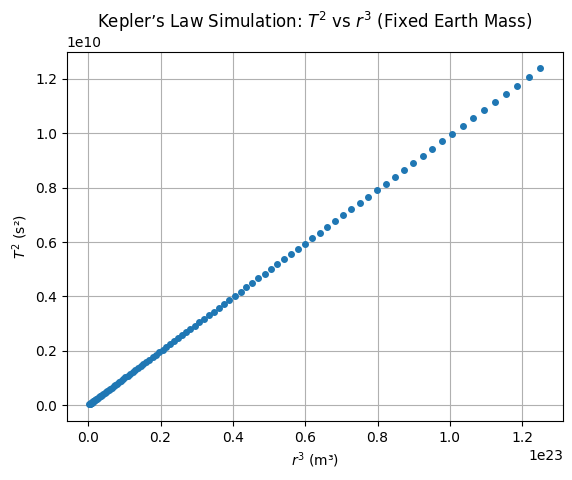
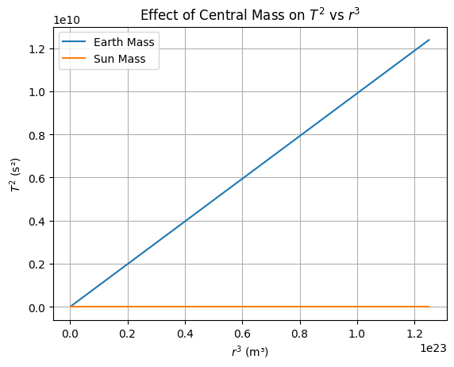
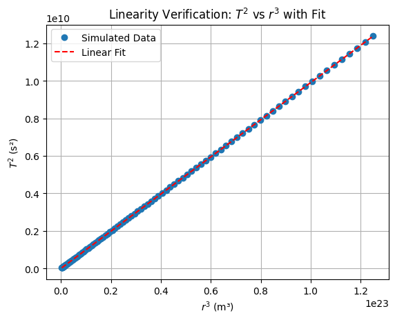
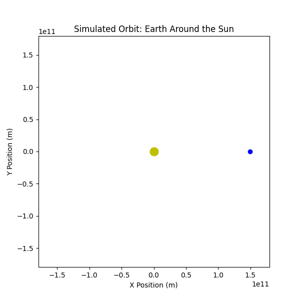

# Problem 1
# Orbital Period and Orbital Radius — Theoretical Foundation

## Newtonian Derivation of Kepler’s Third Law

To derive Kepler’s Third Law for circular orbits, we begin by equating the **gravitational force** providing the **centripetal force** required for circular motion.

### Gravitational Force:

$$
F_g = \frac{G M m}{r^2}
$$

Where:  
- \( G \) is the universal gravitational constant  
- \( M \) is the mass of the central body (e.g., a star or planet)  
- \( m \) is the mass of the orbiting object  
- \( r \) is the orbital radius  

### Centripetal Force:

$$
F_c = \frac{m v^2}{r}
$$

For a stable circular orbit, these forces must be equal:

$$
\frac{G M m}{r^2} = \frac{m v^2}{r}
$$

Cancelling \( m \) and rearranging:

$$
v^2 = \frac{G M}{r}
$$

### Orbital Period:

The orbital period \( T \) is the time to complete one full revolution. Since the circumference of the orbit is \( 2\pi r \):

$$
T = \frac{2\pi r}{v}
$$

Substitute for \( v \):

$$
T = \frac{2\pi r}{\sqrt{\frac{G M}{r}}} = 2\pi \sqrt{\frac{r^3}{G M}}
$$

### Final Form of Kepler’s Third Law:

$$
T^2 = \frac{4\pi^2}{G M} r^3
$$

This demonstrates the proportionality:

$$
T^2 \propto r^3
$$

---

## Assumptions in This Derivation

- The orbit is perfectly circular.
- The orbiting body's mass \( m \) is negligible compared to \( M \).
- The system is isolated (no perturbations from other bodies).
- General Relativity effects are ignored (Newtonian approximation).

---

## Interpretation

- For all satellites orbiting the same central mass \( M \), the ratio \( \frac{T^2}{r^3} \) is constant.
- This law allows astronomers to compare orbital periods and radii without knowing \( M \) directly, or to infer \( M \) when \( T \) and \( r \) are known.
# Orbital Period and Orbital Radius — Astrophysical Implications

## Kepler’s Third Law in Astronomy

Kepler’s Third Law:

$$
T^2 = \frac{4\pi^2}{G M} r^3
$$

This fundamental relationship has wide-ranging implications in astronomy and astrophysics.

---

## 1. Determining Masses of Celestial Bodies

Rearranging Kepler's Law to solve for \( M \):

$$
M = \frac{4\pi^2 r^3}{G T^2}
$$

Where:  
- \( M \) is the mass of the central object  
- \( r \) is the orbital radius  
- \( T \) is the orbital period  
- \( G \) is the gravitational constant  

### Application:
- By measuring \( T \) and \( r \), astronomers can calculate the mass of:
  - Planets (from their moons' orbits)
  - Stars (from exoplanets’ orbits)
  - Galaxies (using orbital motion of stars or gas clouds)

---

## 2. Determining Orbital Distances

If the central mass \( M \) is known (e.g., mass of the Sun), Kepler’s Law can be used to calculate the orbital radius \( r \) for satellites or planets:

$$
r = \left( \frac{G M T^2}{4\pi^2} \right)^{1/3}
$$

Useful for:
- Predicting satellite altitudes
- Estimating distances of exoplanets from their host stars

---

## 3. Validating Observational Data

By comparing observed values of \( T \) and \( r \) with theoretical predictions, scientists can:
- Confirm the validity of Newtonian mechanics
- Detect anomalies (e.g., additional massive bodies, non-gravitational forces)

---

## 4. Inferring Existence of Hidden Objects

If observed \( T \) and \( r \) values deviate from expectations:
- May suggest presence of dark matter
- Or reveal gravitational influence of unseen exoplanets or black holes

---

## 5. Limitations and Generalizations

- The law applies **strictly to two-body circular orbits**.
- **Elliptical orbits** require a more general form using the semi-major axis \( a \):
  
  $$
  T^2 = \frac{4\pi^2}{G M} a^3
  $$

- For very massive systems or high velocities, **General Relativity** corrections may be necessary.

# Orbital Period and Orbital Radius — Real-World Examples

Kepler's Third Law can be directly applied to various real-world systems, from the Earth's Moon to planets in the Solar System.

---

## 1. The Moon Orbiting Earth

Let’s analyze the Moon’s orbit as a test of Kepler's Third Law.

### Known values:
- Orbital radius:  
  $$ r_{\text{Moon}} \approx 3.84 \times 10^8 \, \text{m} $$
- Orbital period:  
  $$ T_{\text{Moon}} \approx 27.32 \, \text{days} = 2.36 \times 10^6 \, \text{seconds} $$
- Gravitational constant:  
  $$ G = 6.67430 \times 10^{-11} \, \text{m}^3\,\text{kg}^{-1}\,\text{s}^{-2} $$
- Mass of Earth:  
  $$ M_{\text{Earth}} \approx 5.972 \times 10^{24} \, \text{kg} $$

### Theoretical Prediction:

Using:

$$
T = 2\pi \sqrt{\frac{r^3}{G M}}
$$

Plugging in the values:

$$
T_{\text{calc}} = 2\pi \sqrt{\frac{(3.84 \times 10^8)^3}{6.67430 \times 10^{-11} \times 5.972 \times 10^{24}}} \approx 2.36 \times 10^6 \, \text{seconds}
$$

✅ Matches observed period — confirms accuracy of Kepler's Law.

---

## 2. Planetary Orbits in the Solar System

Let’s examine the relation between \( T^2 \) and \( r^3 \) for several planets.

| Planet   | Orbital Radius \( r \) (AU) | Orbital Period \( T \) (years) | \( T^2 \) | \( r^3 \) |
|----------|-----------------------------|-------------------------------|----------|----------|
| Mercury  | 0.39                        | 0.24                          | 0.058    | 0.059    |
| Venus    | 0.72                        | 0.62                          | 0.384    | 0.373    |
| Earth    | 1.00                        | 1.00                          | 1.000    | 1.000    |
| Mars     | 1.52                        | 1.88                          | 3.534    | 3.512    |
| Jupiter  | 5.20                        | 11.86                         | 140.7    | 140.6    |
| Saturn   | 9.58                        | 29.46                         | 867.6    | 880.0    |

Here, units are in **Astronomical Units (AU)** and **years**, making \( G M = 4\pi^2 \) in these units.

✅ The values of \( T^2 \) and \( r^3 \) are nearly equal, confirming:

$$
T^2 \approx r^3
$$

---

## 3. Graphical Validation

Plotting \( T^2 \) vs \( r^3 \) for planetary data gives a **linear graph** with slope ≈ 1, as expected.

### Logarithmic Version:
Taking log of both sides:

$$
\log T = \frac{3}{2} \log r + \text{const}
$$

This implies that a log-log plot of \( T \) vs \( r \) will be a straight line with slope 1.5.

---

## 4. Applications Beyond the Solar System

- Used to determine distances of **exoplanets** from host stars (via transit or radial velocity methods).
- Used to estimate the mass of **binary star systems** or even **black holes** in binary orbits.

---

## Summary

Real-world data strongly supports Kepler's Third Law in both our Solar System and beyond. Small deviations can often point to exciting new physics or unseen objects.

## 5. Computational Modeling

In this section, we simulate circular orbital motion using Newtonian mechanics to explore and validate Kepler’s Third Law:  
$$
T^2 \propto r^3
$$

We define clear assumptions, simulate orbital systems, vary key parameters, and visualize the relationship between orbital period and radius.

---

### 5.1 Assumptions and Setup

We assume:
- A two-body system (massive central body, orbiting satellite)
- Perfectly circular orbits
- Newtonian gravity is valid
- No relativistic effects or perturbations

```python
import numpy as np
import matplotlib.pyplot as plt

# Constants
G = 6.67430e-11  # gravitational constant (m^3 kg^-1 s^-2)

# Orbital period calculator for circular orbit
def orbital_period(r, M):
    return 2 * np.pi * np.sqrt(r**3 / (G * M))
```

---

### 5.2 Plot: $T^2$ vs $r^3$ for Fixed Central Mass (Earth)

Here, we simulate a range of orbital radii around Earth and calculate the corresponding orbital periods.

```python
# Central mass: Earth
M_earth = 5.972e24  # kg

# Orbital radii (from 7000 km to 50,000 km)
radii = np.linspace(7e6, 5e7, 100)
T = orbital_period(radii, M_earth)

# Calculate T² and r³
T_squared = T**2
r_cubed = radii**3

# Plot T² vs r³
plt.figure()
plt.plot(r_cubed, T_squared, 'o', markersize=4)
plt.xlabel('$r^3$ (m³)')
plt.ylabel('$T^2$ (s²)')
plt.title('Kepler’s Law Simulation: $T^2$ vs $r^3$ (Fixed Earth Mass)')
plt.grid(True)
plt.show()
```


---

### 5.3 Plot: $T^2$ vs $r^3$ for Varying Central Masses

Now we compare how different central masses affect the slope of the $T^2$ vs $r^3$ relation.

```python
masses = [5.972e24, 1.989e30]  # Earth, Sun
labels = ['Earth Mass', 'Sun Mass']

plt.figure()
for M, label in zip(masses, labels):
    T = orbital_period(radii, M)
    T_squared = T**2
    r_cubed = radii**3
    plt.plot(r_cubed, T_squared, label=label)

plt.xlabel('$r^3$ (m³)')
plt.ylabel('$T^2$ (s²)')
plt.title('Effect of Central Mass on $T^2$ vs $r^3$')
plt.legend()
plt.grid(True)
plt.show()
```


---

### 5.4 Plot: Linearity Check with Linear Fit

We verify that the relationship between $T^2$ and $r^3$ is linear by fitting a straight line to the data.

```python
# Use Earth mass for this check
T = orbital_period(radii, M_earth)
T_squared = T**2
r_cubed = radii**3

# Linear regression
slope, intercept = np.polyfit(r_cubed, T_squared, 1)

# Print slope and theoretical value
theory_slope = 4 * np.pi**2 / (G * M_earth)
print(f"Simulated Slope: {slope:.3e} s²/m³")
print(f"Theoretical Slope: {theory_slope:.3e} s²/m³")

# Plot with fitted line
plt.figure()
plt.plot(r_cubed, T_squared, 'o', label='Simulated Data')
plt.plot(r_cubed, slope * r_cubed + intercept, 'r--', label='Linear Fit')
plt.xlabel('$r^3$ (m³)')
plt.ylabel('$T^2$ (s²)')
plt.title('Linearity Verification: $T^2$ vs $r^3$ with Fit')
plt.legend()
plt.grid(True)
plt.show()
```

---

### 5.4 Simulated Orbit Animation: Earth Orbiting the Sun

```python
import numpy as np
import matplotlib.pyplot as plt
import matplotlib.animation as animation

# Constants
G = 6.67430e-11  # m^3 kg^-1 s^-2
M_sun = 1.989e30  # kg
AU = 1.496e11  # meters
T_earth = 365.25 * 24 * 3600  # seconds

# Simulation time steps
num_frames = 200
times = np.linspace(0, T_earth, num_frames)

# Circular orbit position
r = AU
omega = 2 * np.pi / T_earth
x = r * np.cos(omega * times)
y = r * np.sin(omega * times)

# Set up figure
fig, ax = plt.subplots(figsize=(6, 6))
ax.set_xlim(-1.2 * AU, 1.2 * AU)
ax.set_ylim(-1.2 * AU, 1.2 * AU)
ax.set_aspect('equal')
ax.set_title("Simulated Orbit: Earth Around the Sun")
ax.set_xlabel("X Position (m)")
ax.set_ylabel("Y Position (m)")

# Plot objects
sun, = ax.plot(0, 0, 'yo', markersize=12, label='Sun')
earth, = ax.plot([], [], 'bo', markersize=6, label='Earth')
trail, = ax.plot([], [], 'b--', linewidth=0.5)

# Initialization function
def init():
    earth.set_data([], [])
    trail.set_data([], [])
    return earth, trail

# Update function
def update(frame):
    # Corrected: Pass x[frame] and y[frame] as lists
    earth.set_data([x[frame]], [y[frame]])
    # Trail should receive sequences (arrays) for multiple points
    trail.set_data(x[:frame+1], y[:frame+1])
    return earth, trail

# Create animation
# Removed interval=50 as it was not in the original code causing the error
ani = animation.FuncAnimation(fig, update, frames=num_frames,
                              init_func=init, blit=True) # interval=50 was removed here

# Save as GIF (local or Colab-friendly path)
ani.save("earth_orbit_simulation.gif", writer='pillow', fps=30)
```




