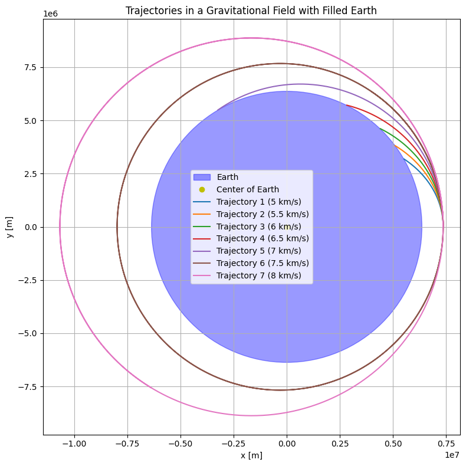
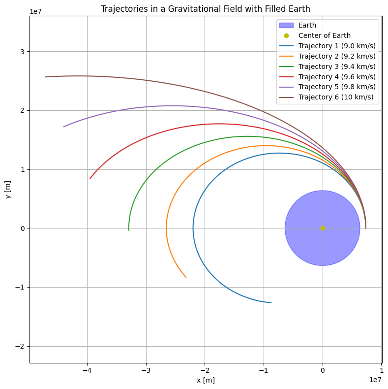
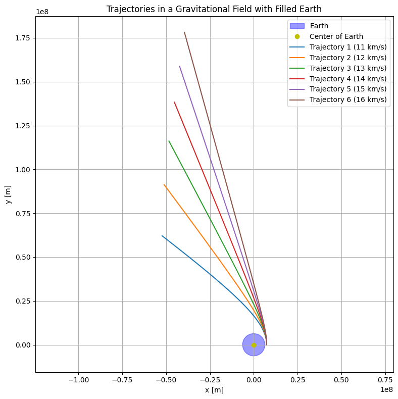

# 1. Physical and Theoretical Foundations

## 1.1 Gravitational Model

1. **Newton’s Law of Universal Gravitation**  
   The gravitational force between Earth and a payload is given by:

   $$
   F = G \frac{Mm}{r^2}
   $$

   Where:  
   - $F$: gravitational force  
   - $G \approx 6.674 \times 10^{-11}\ \text{m}^3\text{kg}^{-1}\text{s}^{-2}$: gravitational constant  
   - $M$: mass of Earth  
   - $m$: mass of the payload  
   - $r$: distance from Earth's center to the payload

2. **Gravitational Acceleration**  
   The acceleration due to Earth's gravity becomes:

   $$
   \vec{a} = - G \frac{M}{r^2} \hat{r}
   $$

3. **Model Assumptions**
   - Point-mass Earth approximation  
   - Spherical Earth radius: $R_\oplus \approx 6.371 \times 10^6\ \text{m}$  
   - Optional extensions:
     - Non-uniform gravity (e.g., J2 perturbation)
     - Atmospheric drag (ignored here)
     - Earth’s rotation (relevant for surface-based frames)

---

## 1.2 Types of Trajectories

4. **Trajectory Categories**  
   Depending on the total energy, possible motion paths include:
   - **Elliptical Orbit**: $\varepsilon < 0$
   - **Parabolic Trajectory**: $\varepsilon = 0$
   - **Hyperbolic Trajectory**: $\varepsilon > 0$

---

## 1.3 Energy-Based Classification

5. **Specific Mechanical Energy**

   $$
   \varepsilon = \frac{v^2}{2} - \frac{GM}{r}
   $$

   - $v$: payload speed  
   - $r$: distance to Earth’s center  
   - $\varepsilon$: total energy per unit mass

6. **Trajectory Conditions Based on $\varepsilon$**
   - $\varepsilon < 0$: Bound orbit (elliptical)
   - $\varepsilon = 0$: Parabolic escape
   - $\varepsilon > 0$: Hyperbolic escape

---

## 1.4 Orbital Velocity Conditions

7. **Escape Velocity Formula**

   $$
   v_{\text{esc}} = \sqrt{\frac{2GM}{r}}
   $$

   - If $v < v_{\text{esc}}$: bound orbit  
   - If $v = v_{\text{esc}}$: parabolic trajectory  
   - If $v > v_{\text{esc}}$: escape on a hyperbolic path

---

## 1.5 Summary Table

8. **Trajectory Type Comparison**

| # | Trajectory Type | Specific Energy $\varepsilon$ | Eccentricity $e$ | Description |
|---|------------------|-------------------------------|------------------|-------------|
| 1 | Elliptical       | $\varepsilon < 0$             | $0 < e < 1$      | Closed orbit |
| 2 | Parabolic        | $\varepsilon = 0$             | $e = 1$          | Critical escape path |
| 3 | Hyperbolic       | $\varepsilon > 0$             | $e > 1$          | Open escape trajectory |

---

# 2. Initial Conditions Definition

## 2.1 Key State Variables

9. **Initial Position**  
   The payload’s position is specified in a coordinate system (typically geocentric inertial or orbital).  
   In Cartesian coordinates:

   $$
   \vec{r}_0 = \begin{bmatrix} x_0 \\ y_0 \\ z_0 \end{bmatrix}
   $$

   Where:
   - $x_0, y_0, z_0$ represent the initial position components relative to Earth's center.

10. **Initial Velocity**  
    The velocity vector at the moment of release is:

    $$
    \vec{v}_0 = \begin{bmatrix} v_{x0} \\ v_{y0} \\ v_{z0} \end{bmatrix}
    $$

    The direction and magnitude of $\vec{v}_0$ determine whether the payload remains in orbit, descends, or escapes.

11. **Initial Altitude**  
    Altitude $h$ is measured from Earth's surface:

    $$
    h = r_0 - R_\oplus
    $$

    Where:
    - $r_0 = \|\vec{r}_0\|$ is the radial distance from Earth's center
    - $R_\oplus$ is Earth's radius

---

## 2.2 Real-World Scenarios

12. **Low Earth Orbit (LEO) Release**

    - Typical altitude: $200 - 2,000\ \text{km}$
    - Circular orbital speed at altitude $h$:

      $$
      v_{\text{LEO}} = \sqrt{\frac{GM}{R_\oplus + h}}
      $$

    - Initial conditions resemble those of the launch vehicle at release time.

13. **Suborbital Flight Release**

    - Altitude typically < $1000\ \text{km}$, may fall back to Earth.
    - Initial vertical component of velocity is significant.
    - May include atmospheric drag in lower portions of the trajectory.

14. **Elliptical Orbit Transfer**

    - If a payload is released during a transfer orbit:
      
      $$
      v_0 \ne v_{\text{circular}}
      $$

    - Requires vector analysis of the release point within an elliptical path.

---

## 2.3 Summary of Required Initial Data

15. To simulate or predict the payload’s trajectory, you must define:
    - Initial position vector $\vec{r}_0$
    - Initial velocity vector $\vec{v}_0$
    - Mass of Earth $M$
    - Gravitational constant $G$
    - Earth radius $R_\oplus$
    - Atmospheric model (optional)
    - Reference frame (e.g., inertial or rotating)

---

# 3. Equations of Motion

## 3.1 Newton’s Second Law in Gravitational Context

16. **Basic Formulation**

According to Newton’s Second Law:

$$
\vec{F} = m \vec{a}
$$

For a gravitational two-body system, the only force acting on the payload is gravity:

$$
\vec{F}_{\text{gravity}} = -G \frac{Mm}{r^2} \hat{r}
$$

Substituting into Newton’s law:

$$
m \vec{a} = -G \frac{Mm}{r^2} \hat{r}
$$

Canceling $m$ (the payload's mass) from both sides:

$$
\vec{a} = -G \frac{M}{r^2} \hat{r}
$$

This gives the second-order differential equation governing motion:

$$
\ddot{\vec{r}} = -G \frac{M}{r^3} \vec{r}
$$

Where:
- $\vec{r}$ is the position vector from Earth’s center to the payload
- $r = \|\vec{r}\|$ is its magnitude

---

## 3.2 Vector Form of Equations of Motion

17. **State-Space Representation**

The motion can also be expressed as a system of first-order differential equations:

$$
\frac{d\vec{r}}{dt} = \vec{v}
$$

$$
\frac{d\vec{v}}{dt} = -G \frac{M}{r^3} \vec{r}
$$

This is commonly used for numerical integration in orbital simulations.

---

## 3.3 Orbital Plane Simplification (2D Case)

18. **Planar Motion Assumption**

Assuming the payload moves in a fixed 2D orbital plane (e.g., $xy$-plane):

$$
\vec{r} = \begin{bmatrix} x(t) \\ y(t) \end{bmatrix}, \quad
\vec{v} = \begin{bmatrix} \dot{x}(t) \\ \dot{y}(t) \end{bmatrix}
$$

The equations of motion become:

$$
\ddot{x} = -G \frac{M x}{(x^2 + y^2)^{3/2}}, \quad
\ddot{y} = -G \frac{M y}{(x^2 + y^2)^{3/2}}
$$

---

## 3.4 Conservation Laws

19. **Energy Conservation**

In the absence of external forces (like atmospheric drag), the **specific mechanical energy** is conserved:

$$
\varepsilon = \frac{v^2}{2} - \frac{GM}{r} = \text{constant}
$$

20. **Angular Momentum Conservation**

Angular momentum per unit mass is also conserved:

$$
\vec{h} = \vec{r} \times \vec{v} = \text{constant vector}
$$

Its magnitude is:

$$
h = r v \sin{\theta}
$$

Where $\theta$ is the angle between $\vec{r}$ and $\vec{v}$.

---

## 3.5 Kepler’s Laws (Brief Overview)

21. **Kepler’s First Law**:  
The orbit of a body around Earth is an ellipse with Earth at one focus.

22. **Kepler’s Second Law**:  
The line joining the body and Earth sweeps out equal areas in equal times.

23. **Kepler’s Third Law**:  
The square of the orbital period $T$ is proportional to the cube of the semi-major axis $a$:

$$
T^2 = \frac{4\pi^2 a^3}{GM}
$$

---

# 4. Numerical Simulation Framework

## 4.1 Motivation for Numerical Methods

24. **Why Numerical Simulation?**  
   The equations of motion for orbital mechanics are nonlinear and, in most practical cases, do not admit closed-form solutions — especially when:
   - Initial conditions are arbitrary
   - Non-conservative forces (e.g., drag) are present
   - Complex mission scenarios (e.g., staged releases, planetary perturbations)

   Thus, we rely on **numerical integration** to approximate the trajectory over discrete time steps.

---

## 4.2 Discretizing the Equations of Motion

25. **State Vector Formulation**

We define the system state vector:

$$
\vec{y} = \begin{bmatrix} \vec{r} \\ \vec{v} \end{bmatrix} =
\begin{bmatrix} x \\ y \\ z \\ \dot{x} \\ \dot{y} \\ \dot{z} \end{bmatrix}
$$

The derivative of the state vector is:

$$
\frac{d\vec{y}}{dt} =
\begin{bmatrix}
\vec{v} \\
- G \frac{M}{r^3} \vec{r}
\end{bmatrix}
$$

This formulation is well-suited to numerical solvers like Runge-Kutta or symplectic integrators.

---

## 4.3 Common Numerical Methods

26. **Euler’s Method** (First-order)
   - Simple but inaccurate for long time scales
   - Update rule:

     $$
     \vec{y}_{n+1} = \vec{y}_n + \Delta t \cdot \frac{d\vec{y}_n}{dt}
     $$

27. **Runge-Kutta Methods** (e.g., RK4)
   - Widely used for orbital problems due to better accuracy
   - Uses multiple intermediate steps per time increment

28. **Symplectic Integrators**
   - Preserve energy and angular momentum better over long time periods
   - Useful in long-term simulations (e.g., planetary systems)

---

## 4.4 Simulation Time Step and Duration

29. **Choosing $\Delta t$**

   The time step $\Delta t$ must be:
   - Small enough to capture fast dynamics
   - Large enough to ensure reasonable simulation speed

   A typical choice for LEO simulations:
   $$
   \Delta t \in [0.1,\ 10] \ \text{seconds}
   $$

30. **Stopping Criteria**
   - Fixed total simulation time $T_{\text{final}}$
   - Payload reaches specific altitude or distance
   - Collision or escape conditions are met

---

## 4.5 Handling Escape and Collision

31. **Escape Detection**

   Check if:

   $$
   \|\vec{r}\| > r_{\text{escape}} \quad \text{and} \quad \varepsilon > 0
   $$

   Then the payload is no longer gravitationally bound to Earth.

32. **Collision Detection**

   Check if:

   $$
   \|\vec{r}\| \leq R_\oplus
   $$

   Then the payload has impacted Earth.

---

## 4.6 Suggested Tools and Libraries

33. **Python-Based Tools**
   - `numpy`: For vector/matrix math
   - `scipy.integrate.solve_ivp`: For solving ODEs
   - `matplotlib`: For plotting trajectories
   - `astropy.constants`: For astronomical constants

34. **Others**
   - MATLAB or Julia for academic research
   - STK, GMAT, or Orekit for industry-grade mission simulation

---


# 5. Classification of Trajectories

## 5.1 Based on Specific Mechanical Energy

35. **Total Specific Mechanical Energy**

The energy per unit mass of a payload in a gravitational field is:

$$
\varepsilon = \frac{v^2}{2} - \frac{GM}{r}
$$

Where:
- $v$ is the magnitude of the velocity vector,
- $r$ is the radial distance from Earth’s center.

36. **Trajectory Categories**

| # | Trajectory Type  | Energy Condition               | Description                     |
|---|------------------|--------------------------------|---------------------------------|
| 1 | Elliptical Orbit | $\varepsilon < 0$             | Closed orbit, bound to Earth    |
| 2 | Parabolic Path   | $\varepsilon = 0$             | Critical escape, marginally unbound |
| 3 | Hyperbolic Path  | $\varepsilon > 0$             | Open trajectory, escapes gravity |

---

## 5.2 Based on Orbital Eccentricity

37. **Eccentricity ($e$)** defines the shape of the orbit:

$$
e = \sqrt{1 + \frac{2 \varepsilon h^2}{(GM)^2}}
$$

Where:
- $h = |\vec{r} \times \vec{v}|$ is the specific angular momentum.

38. **Classification by $e$**

| # | Trajectory Type  | Eccentricity $e$     | Shape              |
|---|------------------|----------------------|--------------------|
| 1 | Circular Orbit   | $e = 0$              | Circle             |
| 2 | Elliptical Orbit | $0 < e < 1$          | Ellipse            |
| 3 | Parabolic Path   | $e = 1$              | Parabola           |
| 4 | Hyperbolic Path  | $e > 1$              | Hyperbola          |

---

## 5.3 Directional and Orbital Characteristics

39. **Prograde vs. Retrograde**

- **Prograde**: Velocity vector aligned with Earth’s rotation (more efficient).
- **Retrograde**: Velocity vector opposite Earth’s rotation (higher energy cost).

40. **Inclination ($i$)**

- Defined as the angle between the orbital plane and Earth’s equator.
- Determines whether an orbit is:
  - **Equatorial** ($i \approx 0^\circ$)
  - **Polar** ($i \approx 90^\circ$)
  - **Inclined** (between $0^\circ$ and $90^\circ$)

---

## 5.4 Escape and Reentry Criteria

41. **Escape Condition**  
Payload has escaped Earth’s gravity if:

$$
\varepsilon > 0 \quad \text{and} \quad \|\vec{r}\| \rightarrow \infty
$$

42. **Reentry Condition**  
Payload will reenter Earth if:

$$
\varepsilon < 0 \quad \text{and} \quad \|\vec{r}\| \leq R_\oplus \quad \text{at any time}
$$

---

## 5.5 Practical Interpretation

43. **Application in Mission Design**

- **Elliptical**: Typical for communication satellites, ISS
- **Parabolic**: Rare in practice; theoretical escape threshold
- **Hyperbolic**: Used for planetary flybys and interplanetary escape
- **Circular**: Ideal for stable, constant-altitude orbits

---

# 6. Computational Implementation

Numerical simulation is the cornerstone of analyzing orbital trajectories. This section describes the **design of simulation components**, including constants, integrators, data structures, and plotting, all implemented in Python using the classical **Runge-Kutta 4th Order (RK4)** method.

---

## 6.1 Physical Constants and Setup

We begin by defining global physical constants and parameters for time-stepping.

```python
import numpy as np
import matplotlib.pyplot as plt

# Physical constants
G = 6.67430e-11            # Gravitational constant [m^3 kg^-1 s^-2]
M = 5.972e24               # Mass of Earth [kg]
R_EARTH = 6.371e6          # Radius of Earth [m]

# Launch altitude and initial position
LAUNCH_ALTITUDE = 1e6      # 1000 km altitude
R0 = R_EARTH + LAUNCH_ALTITUDE

# Time configuration
DT = 10                    # Time step [s]
MAX_TIME = 4 * 3600        # Total simulation time: 4 hours
```

---

## 6.2 Gravitational Acceleration and RK4 Integration

The payload is subject to Newtonian gravity. The motion is integrated using the RK4 method for high accuracy.

### Gravitational Acceleration Function

```python
def acceleration(r):
    r_norm = np.linalg.norm(r)
    return -G * M * r / r_norm**3
```

### RK4 Integration Function

```python
def rk4_step(r, v, dt):
    k1v = acceleration(r)
    k1r = v

    k2v = acceleration(r + 0.5 * dt * k1r)
    k2r = v + 0.5 * dt * k1v

    k3v = acceleration(r + 0.5 * dt * k2r)
    k3r = v + 0.5 * dt * k2v

    k4v = acceleration(r + dt * k3r)
    k4r = v + dt * k3v

    r_next = r + (dt / 6) * (k1r + 2*k2r + 2*k3r + k4r)
    v_next = v + (dt / 6) * (k1v + 2*k2v + 2*k3v + k4v)

    return r_next, v_next
```

---

## 6.3 Trajectory Simulation Loop

This function takes an initial velocity (in km/s), initializes the payload state, and simulates its trajectory using RK4.

```python
def simulate_trajectory(v0_kms):
    r = np.array([R0, 0, 0], dtype=float)
    v = np.array([0, v0_kms * 1000, 0], dtype=float)

    positions = [r.copy()]
    t = 0
    while t < MAX_TIME:
        r, v = rk4_step(r, v, DT)
        if np.linalg.norm(r) < R_EARTH:
            break  # Reentry condition
        positions.append(r.copy())
        t += DT
    return np.array(positions)
```

---

## 6.4 Plotting the Trajectories

We use `matplotlib` to visualize multiple trajectories from various initial speeds. Earth is plotted as a filled circle.

```python
def plot_trajectories(velocity_list):
    plt.figure(figsize=(8, 8))

    # Draw Earth
    earth = plt.Circle((0, 0), R_EARTH, color='blue', alpha=0.4, label='Earth')
    plt.gca().add_patch(earth)
    plt.plot(0, 0, 'yo', label='Center of Earth')

    # Simulate and plot each trajectory
    for i, v0 in enumerate(velocity_list):
        pos = simulate_trajectory(v0)
        x, y = pos[:, 0], pos[:, 1]
        plt.plot(x, y, label=f"Trajectory {i+1} ({v0} km/s)")

    plt.xlabel("x [m]")
    plt.ylabel("y [m]")
    plt.title("Trajectories in a Gravitational Field")
    plt.axis('equal')
    plt.grid(True)
    plt.legend()
    plt.tight_layout()
    plt.show()
```

---

## 6.5 Simulation Examples

### 🔹 Example 1: Suborbital and Near-Orbital Velocities

```python
plot_trajectories([5, 5.5, 6, 6.5, 7, 7.5, 8])
```

### 🔹 Example 2: Elliptical to Escape Velocities

```python
plot_trajectories([9.0, 9.2, 9.4, 9.6, 9.8, 10])
```

### 🔹 Example 3: Hyperbolic Escape Trajectories

```python
plot_trajectories([11, 12, 13, 14, 15])
```

---

# 7. Applications and Real-World Scenarios

Understanding different trajectory types is essential for interpreting and designing space missions. The following section maps **simulated orbital behaviors** to **real-world mission contexts**, helping bridge theoretical modeling and aerospace application.

---

## 7.1 Suborbital Trajectories

**Definition**:  
A suborbital trajectory is one where the object reaches space but **does not complete an orbit** — it falls back to Earth.

**Velocity Condition**:  
Initial speed **less than orbital velocity**, typically < 7.6 km/s.

**Real-World Examples**:
- **Blue Origin New Shepard** flights
- NASA’s **X-15 rocket plane** (1960s)
- **Ballistic missile paths**

**Mission Objectives**:
- Suborbital science and microgravity experiments
- Testing heat shields or reentry dynamics
- Space tourism

---

## 7.2 Elliptical Orbits

**Definition**:  
An orbit with **eccentricity** between 0 and 1. The object is gravitationally bound but travels at varying altitudes.

**Velocity Condition**:  
Initial speed between circular and escape velocity:  
$7.6\ \text{km/s} < v < 11.2\ \text{km/s}$

**Real-World Examples**:
- **Geostationary Transfer Orbits (GTO)**
- **Molniya orbits** (highly elliptical)
- Apollo parking orbits before trans-lunar injection

**Mission Objectives**:
- Placing satellites in high Earth orbit
- Delaying or staging for interplanetary missions
- Long-duration visibility for high-latitude regions

---

## 7.3 Circular Orbits

**Definition**:  
An orbit with **eccentricity = 0**. Constant altitude and velocity.

**Velocity Condition**:  
Exactly the **first cosmic velocity**:  
$v_{\text{circular}} = \sqrt{\frac{GM}{r}}$

**Real-World Examples**:
- **International Space Station (ISS)**
- Many **Low Earth Orbit (LEO)** satellites
- Earth observation missions

**Mission Objectives**:
- Communication and surveillance satellites
- Crew habitats and long-term missions
- Scientific research in microgravity

---

## 7.4 Parabolic Trajectories

**Definition**:  
Theoretical boundary case between bound and unbound motion ($e = 1$).

**Velocity Condition**:  
Exact **escape velocity**:  
$v = \sqrt{\frac{2GM}{r}}$

**Real-World Examples**:
- Rare in practice; used as a design threshold
- Simulated for **emergency escape paths**

**Mission Objectives**:
- Escape Earth without long-term orbit
- Trajectory modeling for **asteroid deflection** concepts

---

## 7.5 Hyperbolic Trajectories

**Definition**:  
Open trajectory with **eccentricity > 1**. The object escapes Earth's gravity permanently.

**Velocity Condition**:  
Initial speed **greater than escape velocity**

**Real-World Examples**:
- **Voyager 1 & 2** and **Pioneer** missions
- Flybys for **gravity assists**
- **Space probes** leaving Earth for other planets

**Mission Objectives**:
- Interplanetary travel
- Deep-space exploration
- Gravitational assist maneuvers (e.g., slingshot effects)

---

## 7.6 Summary Table

| Trajectory Type  | Velocity Range       | Eccentricity $e$ | Mission Context                       |
|------------------|----------------------|------------------|----------------------------------------|
| Suborbital       | $v < 7.6\ \text{km/s}$ | $e < 1$          | Reentry testing, tourism, missiles     |
| Circular Orbit   | $v = 7.6\ \text{km/s}$ | $e = 0$          | ISS, GPS, Earth science missions       |
| Elliptical Orbit | $7.6 < v < 11.2$       | $0 < e < 1$      | GTOs, lunar transfers, Molniya orbits  |
| Parabolic Path   | $v = 11.2\ \text{km/s}$ | $e = 1$          | Escape threshold modeling              |
| Hyperbolic Path  | $v > 11.2\ \text{km/s}$ | $e > 1$          | Voyager, Mars missions, deep space     |


### Colab
[Souce Code](https://colab.research.google.com/drive/1uIWTssl_k1bevi-HXL3HIAm_7zuU74xZ#scrollTo=jehPGdMWLbgX)