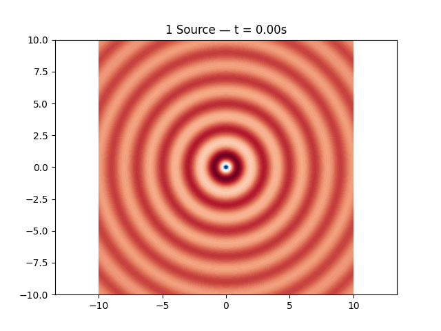
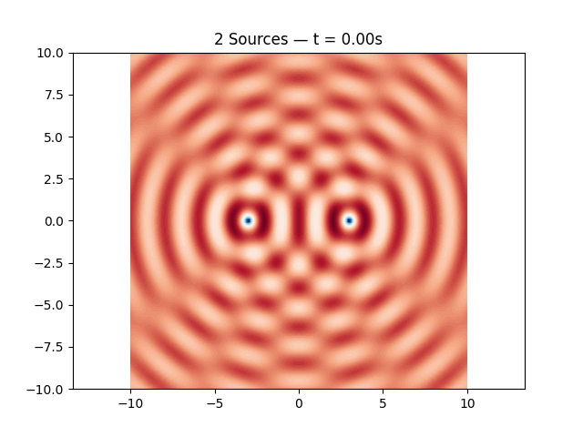
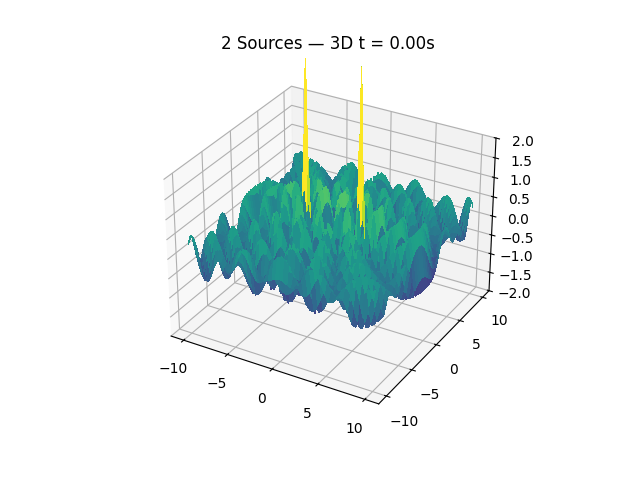
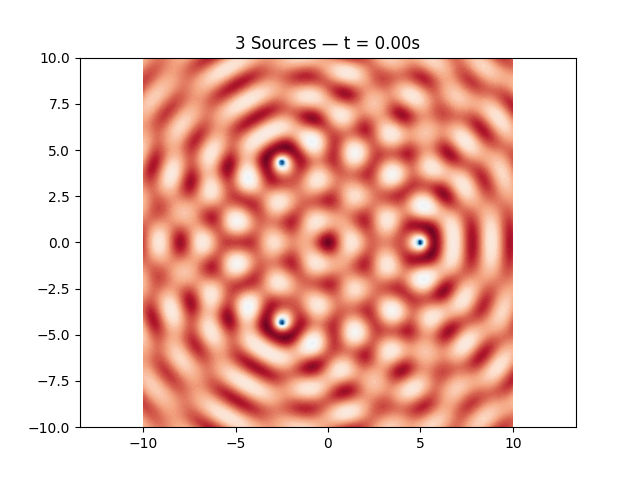
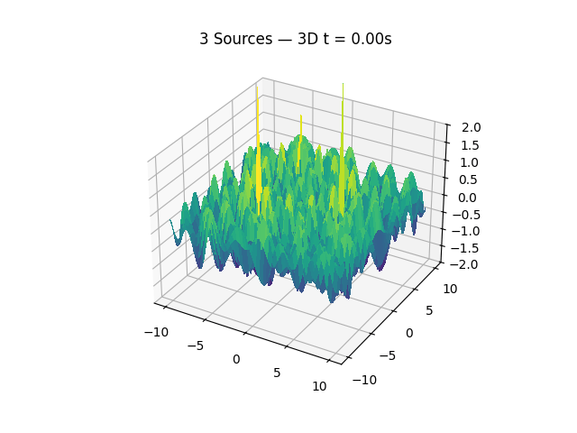
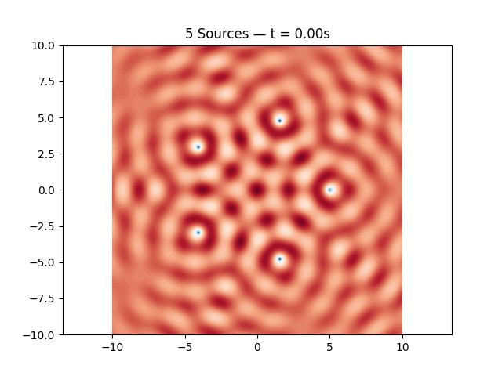
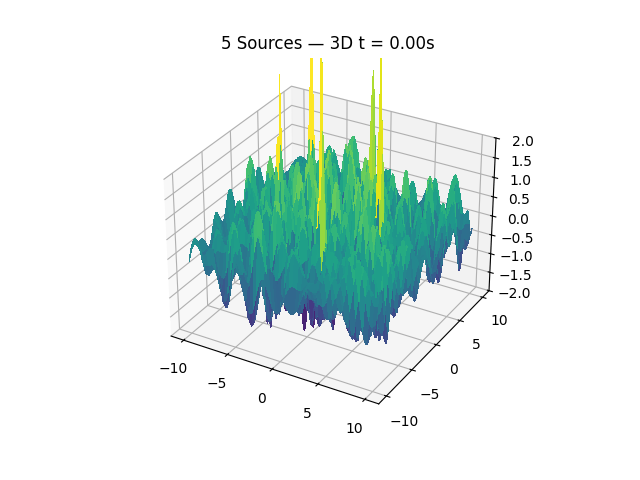

# Problem 1
# Interference Patterns on a Water Surface
## 1. Mathematical Setup

Understanding the formation of interference patterns on a water surface begins with a careful mathematical formulation of the geometry and source arrangement. In this setup, we focus on placing point wave sources at the **vertices of a regular polygon**, centered around the origin.

---

### 1.1 Choosing a Regular Polygon

We consider a regular polygon with $N$ sides, where $N \in \mathbb{N}$ and $N \geq 3$. Regular polygons have the following properties:

- All sides are of equal length.
- All interior angles are equal.
- Vertices are evenly spaced on a circle.

Each vertex lies on a circle of radius $R$, centered at the origin $(0, 0)$. Examples include:

- $N = 3$: Equilateral triangle
- $N = 4$: Square
- $N = 5$: Regular pentagon
- $N = 6$: Regular hexagon

The angle subtended between adjacent vertices is given by:

$$
\theta = \frac{2\pi}{N}
$$

---

### 1.2 Vertex Coordinates

Assuming the center of the polygon is at the origin $(0, 0)$, the angle $\alpha_i$ of the $i$-th vertex relative to the positive $x$-axis is:

$$
\alpha_i = \theta \cdot i = \frac{2\pi i}{N}, \quad \text{for } i = 0, 1, \dots, N - 1
$$

Using polar to Cartesian conversion, the coordinates $(x_i, y_i)$ of the $i$-th vertex are:

$$
x_i = R \cdot \cos\left(\frac{2\pi i}{N}\right)
$$

$$
y_i = R \cdot \sin\left(\frac{2\pi i}{N}\right)
$$

So each vertex is located at:

$$
(x_i, y_i) = \left(R \cdot \cos\left(\frac{2\pi i}{N}\right), \; R \cdot \sin\left(\frac{2\pi i}{N}\right)\right), \quad i = 0, 1, \dots, N - 1
$$

---

### 1.3 Symmetry and Structure

This arrangement ensures:

- Rotational symmetry of order $N$
- Uniform distribution of wave sources
- Mathematical convenience for simulation

---

## 2. Wave Source Modeling

Each vertex of the selected regular polygon acts as a **point source** emitting circular waves on the water surface. These waves propagate outward, interfere with one another, and produce complex patterns due to superposition.

---

### 2.1 Assigning Wave Sources

Let the total number of vertices (and therefore wave sources) be $N$.

Each source is placed at a vertex coordinate:

$$
(x_i, y_i) = \left(R \cdot \cos\left(\frac{2\pi i}{N}\right), \; R \cdot \sin\left(\frac{2\pi i}{N}\right)\right), \quad i = 0, 1, \dots, N - 1
$$

Each vertex emits a **circular, radially symmetric wave**, spreading out from its center.

---

### 2.2 Defining Wave Parameters

Each wave is described by the following displacement function:

$$
\eta_i(x, y, t) = \frac{A}{\sqrt{r_i}} \cdot \cos\left(k r_i - \omega t + \phi\right)
$$

where:

- $\eta_i(x, y, t)$ is the vertical displacement at point $(x, y)$ and time $t$ due to the $i$-th source
- $A$ is the amplitude of the wave (constant for all sources)
- $r_i = \sqrt{(x - x_i)^2 + (y - y_i)^2}$ is the distance from the $i$-th source to the observation point
- $k = \dfrac{2\pi}{\lambda}$ is the **wave number**, with $\lambda$ as the wavelength
- $\omega = 2\pi f$ is the **angular frequency**, with $f$ as the temporal frequency
- $\phi$ is the **initial phase** of the wave (same for all sources if coherent)

Assuming **coherent sources**, all waves share the same values of $A$, $\lambda$, $f$, and $\phi$.

---

### 2.3 Coherence Assumption

For simplicity and physical realism:

- All sources emit waves **in phase**: $\phi_i = \phi$ for all $i$
- All waves have the **same frequency and wavelength**: $f_i = f$, $\lambda_i = \lambda$
- The medium is homogeneous and isotropic, allowing **identical propagation speed** for all waves

This assumption ensures that observed interference is purely due to **path length differences**, not source variability.

---

## 3. Wave Equation Implementation

With the geometry and wave parameters defined, we now formulate the explicit mathematical expression for the wave generated by each source.

---

### 3.1 General Form of a Circular Wave

The displacement of the water surface caused by a **single point source** located at $(x_i, y_i)$ is given by:

$$
\eta_i(x, y, t) = \frac{A}{\sqrt{r_i}} \cdot \cos\left(k r_i - \omega t + \phi\right)
$$

where:

- $\eta_i(x, y, t)$: surface displacement at point $(x, y)$ and time $t$ due to the $i$-th source
- $A$: wave amplitude
- $k = \dfrac{2\pi}{\lambda}$: wave number
- $\omega = 2\pi f$: angular frequency
- $\phi$: initial phase
- $r_i$: radial distance from source $i$ to point $(x, y)$

---

### 3.2 Distance from Source to Field Point

The radial distance $r_i$ from the $i$-th source to an arbitrary point $(x, y)$ on the water surface is:

$$
r_i = \sqrt{(x - x_i)^2 + (y - y_i)^2}
$$

Substituting $r_i$ into the wave function:

$$
\eta_i(x, y, t) = \frac{A}{\sqrt{(x - x_i)^2 + (y - y_i)^2}} \cdot \cos\left(k \sqrt{(x - x_i)^2 + (y - y_i)^2} - \omega t + \phi\right)
$$

This equation fully describes the spatiotemporal behavior of the wave from source $i$.

---

### 3.3 Summary of Parameters

| Symbol | Description | Unit |
|--------|-------------|------|
| $A$ | Amplitude | meters (m) |
| $\lambda$ | Wavelength | meters (m) |
| $f$ | Frequency | hertz (Hz) |
| $k$ | Wave number, $k = \dfrac{2\pi}{\lambda}$ | radians/m |
| $\omega$ | Angular frequency, $\omega = 2\pi f$ | radians/s |
| $\phi$ | Initial phase | radians |
| $r_i$ | Distance from source to $(x, y)$ | meters (m) |

---

## 4. Superposition Principle

In wave physics, the **principle of superposition** states that when multiple waves overlap in space, the resulting displacement at any point is the **algebraic sum** of the individual wave displacements at that point.

---

### 4.1 Total Wave Displacement

Given $N$ coherent point sources, each located at $(x_i, y_i)$ and producing a wave described by:

$$
\eta_i(x, y, t) = \frac{A}{\sqrt{(x - x_i)^2 + (y - y_i)^2}} \cdot \cos\left(k \sqrt{(x - x_i)^2 + (y - y_i)^2} - \omega t + \phi\right)
$$

The **total surface displacement** $\eta_{\text{sum}}(x, y, t)$ at point $(x, y)$ and time $t$ is given by:

$$
\eta_{\text{sum}}(x, y, t) = \sum_{i=1}^{N} \eta_i(x, y, t)
$$

This summation must be computed **pointwise** across the surface domain of interest.

---

### 4.2 Physical Interpretation

- Where waves **constructively interfere** (peaks meet peaks or troughs meet troughs), the displacement magnitude increases.
- Where waves **destructively interfere** (peaks meet troughs), the displacement magnitude decreases or cancels out.
- The resulting interference pattern is a direct consequence of differences in the **path lengths** $r_i$ and the shared phase/frequency properties of the waves.

---

### 4.3 Time Dependency

Although the full function $\eta_{\text{sum}}(x, y, t)$ evolves over time, many visual analyses are conducted by examining a **snapshot in time**, such as:

$$
t = 0 \quad \Rightarrow \quad \eta_{\text{sum}}(x, y, 0)
$$

This captures the spatial interference pattern formed at a specific moment and is useful for visualization and interpretation.

---

## 5. Simulation Grid and Animated Visualization (with GIF Export and Inline Display)

We simulate time-evolving wave interference patterns from multiple coherent point sources. For each configuration (1, 2, 3, and 5 sources), we generate:

- A 2D animated contour plot
- A 3D animated surface plot

Each animation is saved as a `.gif` and displayed inline using base64 encoding.

---

### 5.1 Setup and Wave Function

```python
import numpy as np
import matplotlib.pyplot as plt
import matplotlib.animation as animation
from mpl_toolkits.mplot3d import Axes3D
from IPython.display import HTML
import base64

# Wave parameters
A = 1
wavelength = 2
k = 2 * np.pi / wavelength
f = 1
omega = 2 * np.pi * f
phi = 0

# Grid setup
x = np.linspace(-10, 10, 200)
y = np.linspace(-10, 10, 200)
X, Y = np.meshgrid(x, y)

# Wave superposition function
def compute_eta(sources, t):
    eta = np.zeros_like(X)
    for (x0, y0) in sources:
        R = np.sqrt((X - x0)**2 + (Y - y0)**2)
        R[R == 0] = 1e-10
        eta += A / np.sqrt(R) * np.cos(k * R - omega * t + phi)
    return eta

# Display helper
def display_gif(gif_path):
    with open(gif_path, 'rb') as f:
        gif_data = f.read()
    b64_gif = base64.b64encode(gif_data).decode('utf-8')
    return HTML(f'')
````

---

### 5.2 One Source — 2D and 3D Animation

```python
# Source configuration
sources = [(0, 0)]
N = 1

# 2D Animation
fig, ax = plt.subplots()
def update_2d(frame):
    t = frame * 0.1
    ax.clear()
    eta = compute_eta(sources, t)
    ax.contourf(X, Y, eta, levels=100, cmap='RdBu')
    ax.set_title(f'{N} Source — t = {t:.2f}s')
    ax.axis('equal')

ani = animation.FuncAnimation(fig, update_2d, frames=60, interval=100)
gif_path = f'interference_{N}_source_2D.gif'
ani.save(gif_path, writer='pillow', fps=10)
display_gif(gif_path)
```

```python
# 3D Animation
fig = plt.figure()
ax = fig.add_subplot(111, projection='3d')
def update_3d(frame):
    t = frame * 0.1
    ax.clear()
    eta = compute_eta(sources, t)
    ax.plot_surface(X, Y, eta, cmap='viridis', linewidth=0, antialiased=False)
    ax.set_title(f'{N} Source — 3D t = {t:.2f}s')
    ax.set_zlim(-2, 2)

ani3d = animation.FuncAnimation(fig, update_3d, frames=60, interval=100)
gif_path = f'interference_{N}_source_3D.gif'
ani3d.save(gif_path, writer='pillow', fps=10)
display_gif(gif_path)
```

---

### 5.3 Two Sources — 2D and 3D Animation

```python
sources = [(-3, 0), (3, 0)]
N = 2

# 2D Animation
fig, ax = plt.subplots()
def update_2d(frame):
    t = frame * 0.1
    ax.clear()
    eta = compute_eta(sources, t)
    ax.contourf(X, Y, eta, levels=100, cmap='RdBu')
    ax.set_title(f'{N} Sources — t = {t:.2f}s')
    ax.axis('equal')

ani = animation.FuncAnimation(fig, update_2d, frames=60, interval=100)
gif_path = f'interference_{N}_sources_2D.gif'
ani.save(gif_path, writer='pillow', fps=10)
display_gif(gif_path)
```

```python
# 3D Animation
fig = plt.figure()
ax = fig.add_subplot(111, projection='3d')
def update_3d(frame):
    t = frame * 0.1
    ax.clear()
    eta = compute_eta(sources, t)
    ax.plot_surface(X, Y, eta, cmap='viridis', linewidth=0, antialiased=False)
    ax.set_title(f'{N} Sources — 3D t = {t:.2f}s')
    ax.set_zlim(-2, 2)

ani3d = animation.FuncAnimation(fig, update_3d, frames=60, interval=100)
gif_path = f'interference_{N}_sources_3D.gif'
ani3d.save(gif_path, writer='pillow', fps=10)
display_gif(gif_path)
```

---

### 5.4 Three Sources (Triangle) — 2D and 3D Animation

```python
N = 3
R_polygon = 5
sources = [(R_polygon * np.cos(2*np.pi*i/N), R_polygon * np.sin(2*np.pi*i/N)) for i in range(N)]

# 2D Animation
fig, ax = plt.subplots()
def update_2d(frame):
    t = frame * 0.1
    ax.clear()
    eta = compute_eta(sources, t)
    ax.contourf(X, Y, eta, levels=100, cmap='RdBu')
    ax.set_title(f'{N} Sources — t = {t:.2f}s')
    ax.axis('equal')

ani = animation.FuncAnimation(fig, update_2d, frames=60, interval=100)
gif_path = f'interference_{N}_sources_2D.gif'
ani.save(gif_path, writer='pillow', fps=10)
display_gif(gif_path)
```

```python
# 3D Animation
fig = plt.figure()
ax = fig.add_subplot(111, projection='3d')
def update_3d(frame):
    t = frame * 0.1
    ax.clear()
    eta = compute_eta(sources, t)
    ax.plot_surface(X, Y, eta, cmap='viridis', linewidth=0, antialiased=False)
    ax.set_title(f'{N} Sources — 3D t = {t:.2f}s')
    ax.set_zlim(-2, 2)

ani3d = animation.FuncAnimation(fig, update_3d, frames=60, interval=100)
gif_path = f'interference_{N}_sources_3D.gif'
ani3d.save(gif_path, writer='pillow', fps=10)
display_gif(gif_path)
```

---

### 5.5 Five Sources (Pentagon) — 2D and 3D Animation

```python
N = 5
R_polygon = 5
sources = [(R_polygon * np.cos(2*np.pi*i/N), R_polygon * np.sin(2*np.pi*i/N)) for i in range(N)]

# 2D Animation
fig, ax = plt.subplots()
def update_2d(frame):
    t = frame * 0.1
    ax.clear()
    eta = compute_eta(sources, t)
    ax.contourf(X, Y, eta, levels=100, cmap='RdBu')
    ax.set_title(f'{N} Sources — t = {t:.2f}s')
    ax.axis('equal')

ani = animation.FuncAnimation(fig, update_2d, frames=60, interval=100)
gif_path = f'interference_{N}_sources_2D.gif'
ani.save(gif_path, writer='pillow', fps=10)
display_gif(gif_path)
```

```python
# 3D Animation
fig = plt.figure()
ax = fig.add_subplot(111, projection='3d')
def update_3d(frame):
    t = frame * 0.1
    ax.clear()
    eta = compute_eta(sources, t)
    ax.plot_surface(X, Y, eta, cmap='viridis', linewidth=0, antialiased=False)
    ax.set_title(f'{N} Sources — 3D t = {t:.2f}s')
    ax.set_zlim(-2, 2)

ani3d = animation.FuncAnimation(fig, update_3d, frames=60, interval=100)
gif_path = f'interference_{N}_sources_3D.gif'
ani3d.save(gif_path, writer='pillow', fps=10)
display_gif(gif_path)
```

---

## 6. Analysis and Explanation

The interference patterns formed by multiple wave sources are deeply influenced by the **geometric symmetry** of their arrangement and the fundamental **principles of wave behavior**. In this section, we analyze the resulting patterns and interpret their physical significance.

---

### 6.1 Interpreting Patterns Based on Geometry

The configuration of wave sources at the vertices of a regular polygon introduces specific spatial symmetries into the interference pattern:

- For a polygon with $N$ sides, there is an **$N$-fold rotational symmetry** in the interference pattern.
- The interference pattern exhibits **periodic structures** and **nodal lines** (regions of destructive interference) that radiate outward or form closed loops.
- The **distance between sources** and the **radius $R$** of the polygon directly affect the density and spacing of the interference fringes.

#### Examples:
- **Triangle ($N=3$):** Produces a 3-fold symmetry pattern with prominent lobes spaced at $120^\circ$ intervals.
- **Square ($N=4$):** Results in a cross-shaped interference pattern with symmetry along both $x$ and $y$ axes.
- **Pentagon ($N=5$):** Creates a more intricate pattern with fivefold symmetry, exhibiting complex combinations of constructive and destructive regions.

As $N$ increases, the pattern approaches **circular symmetry**, similar to a ring of sources (e.g., a circular aperture in wave optics).

---

### 6.2 Explaining the Physical Meaning

The resulting interference patterns arise from the **principle of linear superposition**:

$$
\eta_{\text{sum}}(x, y, t) = \sum_{i=1}^{N} \eta_i(x, y, t)
$$

Where each $\eta_i$ represents the wave contribution from source $i$. The total displacement at a point $(x, y)$ is the algebraic sum of all wave contributions.

#### Key Physical Phenomena:

- **Constructive Interference:**  
  Occurs when waves arrive **in phase** (their peaks align), producing a local maximum in displacement.

- **Destructive Interference:**  
  Occurs when waves arrive **out of phase** (peak meets trough), resulting in cancellation or minimum displacement.

- **Path Difference and Phase Relationship:**  
  The interference at any point depends on the relative **path lengths $r_i$** from each source to that point. Equal path lengths lead to constructive interference, while differences of $\frac{\lambda}{2}, \frac{3\lambda}{2}, \dots$ cause destructive interference.

#### Wave Coherence:

Because all sources are assumed **coherent** (same frequency $f$, wavelength $\lambda$, amplitude $A$, and phase $\phi$), the **interference pattern is stable over time**, simply oscillating with frequency $f$.

#### Time Dependence:

Though the wave field $\eta(x, y, t)$ varies in time, the **spatial structure of the interference pattern** is defined by the fixed positions of the sources and the wavelength $\lambda$. At any instant $t$, the same nodal and antinodal structures appear, merely oscillating in magnitude.

---

### 6.3 Summary of Observations

| Configuration | Dominant Features | Symmetry |
|---------------|-------------------|----------|
| 1 Source      | Radial ripples     | Circular |
| 2 Sources     | Stripes, fringes   | Mirror symmetry |
| 3 Sources     | Radial lobes       | 3-fold   |
| 4 Sources     | Grid-like nodes    | 4-fold (cross) |
| 5 Sources     | Starburst pattern  | 5-fold   |

These observations illustrate the direct link between **geometry**, **symmetry**, and **interference phenomena** in wave physics.

---

