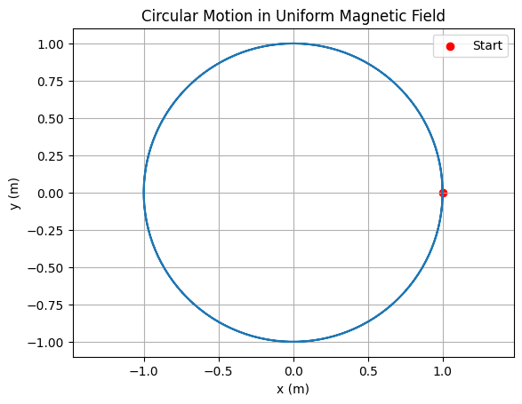
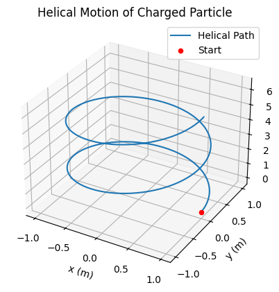
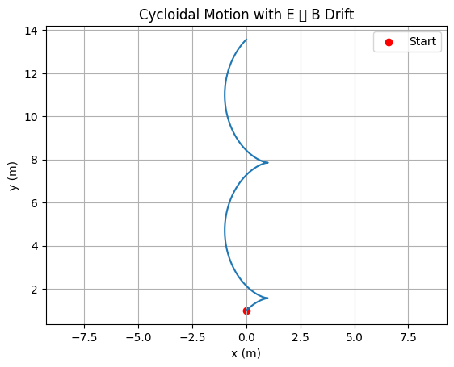
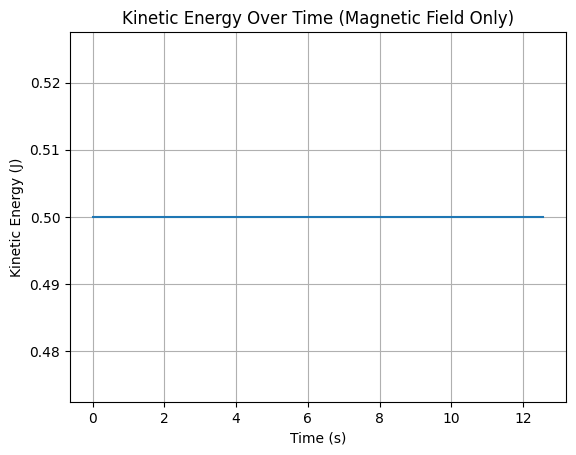

# Problem 1 
## 🔧 **1. Conceptual Foundation**

* Understand the **Lorentz Force equation**:

  $$
  \mathbf{F} = q\mathbf{E} + q\mathbf{v} \times \mathbf{B}
  $$

  This fundamental equation describes the force $\mathbf{F}$ experienced by a charged particle of charge $q$ moving with velocity $\mathbf{v}$ in the presence of an electric field $\mathbf{E}$ and a magnetic field $\mathbf{B}$. The total force is the sum of:

  - The **electric force**: $q\mathbf{E}$
  - The **magnetic force**: $q\mathbf{v} \times \mathbf{B}$

  Note that the magnetic part depends on the direction of motion, making it inherently velocity-dependent and always perpendicular to the velocity vector and the magnetic field.

* Break down the force into electric and magnetic components:

  - If only $\mathbf{E}$ is present:
    $$
    \mathbf{F} = q\mathbf{E}
    $$

    The particle accelerates linearly in the direction of the electric field.

  - If only $\mathbf{B}$ is present:
    $$
    \mathbf{F} = q\mathbf{v} \times \mathbf{B}
    $$

    The force is perpendicular to both $\mathbf{v}$ and $\mathbf{B}$, leading to circular or helical motion, depending on initial conditions.

* Derive the **equations of motion**:

  Starting from Newton's second law:
  $$
  m\frac{d\mathbf{v}}{dt} = q\mathbf{E} + q\mathbf{v} \times \mathbf{B}
  $$

  Rearranging:
  $$
  \frac{d\mathbf{v}}{dt} = \frac{q}{m}\mathbf{E} + \frac{q}{m}(\mathbf{v} \times \mathbf{B})
  $$

  This is a **vector differential equation** governing the time evolution of the velocity of the particle. To obtain position, integrate velocity:
  $$
  \frac{d\mathbf{r}}{dt} = \mathbf{v}(t)
  $$

  Together, this system describes the full motion:
  $$
  \begin{cases}
  \frac{d\mathbf{v}}{dt} = \frac{q}{m}(\mathbf{E} + \mathbf{v} \times \mathbf{B}) \\
  \frac{d\mathbf{r}}{dt} = \mathbf{v}
  \end{cases}
  $$

  These equations typically require **numerical methods** for most non-trivial configurations of $\mathbf{E}$ and $\mathbf{B}$.

## 🌍 **2. Application Contexts**

* Research real-world systems where Lorentz force is critical:

  The Lorentz force is a foundational principle in electromagnetism and underpins many advanced technologies. Below are key systems where this force governs charged particle behavior:

  ### 🔬 Particle Accelerators

  Devices such as **cyclotrons** and **synchrotrons** use magnetic and electric fields to accelerate charged particles (like protons or electrons) to high speeds.

  - Magnetic fields bend the particle trajectories into circular paths:
    $$
    r = \frac{mv}{qB}
    $$
    where $r$ is the radius of the circular path, $m$ is the particle mass, $v$ its speed, $q$ the charge, and $B$ the magnetic field strength.
  
  - Electric fields are applied in gaps to increase the particle’s energy during each revolution.

  ### ⚖️ Mass Spectrometers

  These instruments separate ions based on their **mass-to-charge ratio** ($m/q$).

  - Ions enter a region with a known magnetic field, and the curvature of their path depends on:
    $$
    \frac{mv^2}{r} = qvB \quad \Rightarrow \quad \frac{m}{q} = \frac{rB}{v}
    $$

  - By measuring $r$, the radius of curvature, and knowing $B$ and $v$, one can deduce the mass of the ion.

  ### 🔒 Plasma Confinement (e.g., Tokamaks)

  In fusion devices like **tokamaks**, strong magnetic fields are used to **confine hot plasma**.

  - Charged particles spiral around magnetic field lines due to the Lorentz force:
    $$
    \mathbf{F}_{\text{mag}} = q\mathbf{v} \times \mathbf{B}
    $$
  - The goal is to trap the plasma long enough for fusion reactions to occur while minimizing particle losses.

  ### 🌌 Cosmic Ray Trajectories in Space

  - Charged cosmic rays entering Earth’s magnetic field follow complex **helical** and **drift** paths.
  - The Lorentz force affects their entry points and energy loss via spiraling motion:
    $$
    \mathbf{F} = q\mathbf{v} \times \mathbf{B}_{\text{Earth}}
    $$
  - This principle also explains why Earth's poles are more exposed to auroral activity.

  ### 📺 Cathode Ray Tubes (CRTs)

  - In older televisions and oscilloscopes, **electrons** are accelerated and deflected using electric and magnetic fields.
  - The image on the screen is formed by steering the electron beam via Lorentz force principles:
    $$
    \mathbf{F} = q(\mathbf{E} + \mathbf{v} \times \mathbf{B})
    $$
  - Precise control of $\mathbf{E}$ and $\mathbf{B}$ determines beam position on the screen.

## ⚙️ **3. Simulating Particle Motion**

To study how the Lorentz force affects particle motion, we simulate the trajectory of a charged particle under different field configurations. The goal is to numerically solve the equations of motion derived earlier:

$$
\begin{cases}
\frac{d\mathbf{v}}{dt} = \frac{q}{m}(\mathbf{E} + \mathbf{v} \times \mathbf{B}) \\
\frac{d\mathbf{r}}{dt} = \mathbf{v}
\end{cases}
$$

These are typically solved using numerical methods, such as the **Euler method** or **Runge-Kutta methods**.

---

### 🧲 **a. Uniform Magnetic Field Only**

- Set $\mathbf{E} = 0$ and $\mathbf{B} = B\hat{\mathbf{z}}$.
- The force becomes:
  $$
  \mathbf{F} = q\mathbf{v} \times \mathbf{B}
  $$
- If the initial velocity is perpendicular to $\mathbf{B}$, the particle undergoes **circular motion** in the $xy$-plane.
- The **Larmor radius** is:
  $$
  r_L = \frac{mv_\perp}{qB}
  $$
- The **cyclotron frequency** (angular frequency of rotation) is:
  $$
  \omega_c = \frac{qB}{m}
  $$

- If the initial velocity has a component parallel to $\mathbf{B}$, the result is **helical motion** along the field lines.

---

### ⚡ **b. Uniform Electric and Magnetic Fields**

- When both fields are present:
  $$
  \mathbf{F} = q\mathbf{E} + q\mathbf{v} \times \mathbf{B}
  $$
- The solution depends on the **relative orientation** of $\mathbf{E}$ and $\mathbf{B}$.

#### Case: $\mathbf{E} \parallel \mathbf{B}$

- The electric field accelerates the particle linearly along the field direction.
- The magnetic field causes circular motion perpendicular to the field, resulting in **spiral or helical motion with increasing radius**.

#### Case: $\mathbf{E} \perp \mathbf{B}$

- A key result is the **$\mathbf{E} \times \mathbf{B}$ drift**:
  $$
  \mathbf{v}_d = \frac{\mathbf{E} \times \mathbf{B}}{B^2}
  $$
- The particle follows a **cycloidal path** superimposed on a net drift with velocity $\mathbf{v}_d$.
- This drift is **independent of particle charge and mass**.

---

### 🔁 **c. Numerical Implementation**

To compute particle trajectories:

1. Initialize: $\mathbf{r}_0$, $\mathbf{v}_0$, $\mathbf{E}$, $\mathbf{B}$, $q$, $m$.
2. Select a time step $\Delta t$.
3. At each time step:
   - Compute acceleration:
     $$
     \mathbf{a} = \frac{q}{m}(\mathbf{E} + \mathbf{v} \times \mathbf{B})
     $$
   - Update velocity and position:
     $$
     \mathbf{v}_{n+1} = \mathbf{v}_n + \mathbf{a}_n \Delta t
     $$
     $$
     \mathbf{r}_{n+1} = \mathbf{r}_n + \mathbf{v}_{n+1} \Delta t
     $$
4. Repeat until desired simulation time is reached.

This simulation enables visualization of complex particle dynamics in electromagnetic environments.

## 🔢 **4. Parameter Exploration**

To deeply understand the behavior of charged particles under the Lorentz force, we perform a systematic exploration of key physical parameters. The aim is to investigate how variations in these values affect particle trajectories, energy, and derived quantities like the Larmor radius or drift velocity.

---

### ⚙️ Parameters to Explore

1. **Electric Field Strength** ($\mathbf{E}$)
2. **Magnetic Field Strength** ($\mathbf{B}$)
3. **Initial Velocity** ($\mathbf{v}_0$)
4. **Particle Charge and Mass** ($q$, $m$)

These values are used in the core differential equation:

$$
\frac{d\mathbf{v}}{dt} = \frac{q}{m}(\mathbf{E} + \mathbf{v} \times \mathbf{B})
$$

---

### 📊 Observing Trajectory Changes

By altering the above parameters, we can observe:

- Changes in **orbital radius**, curvature, or helicity of the path.
- Whether the motion remains **bounded (circular/spiral)** or becomes **linear (acceleration)**.
- Emergence of **drift motion** in crossed fields.
- Resonance effects if time-varying fields are introduced (advanced case).

---

### 📏 Larmor Radius

The **Larmor radius** is sensitive to changes in $v_\perp$, $q$, $B$, and $m$:

$$
r_L = \frac{mv_\perp}{qB}
$$

- Increasing $v_\perp$ or $m$ increases the radius.
- Increasing $q$ or $B$ decreases the radius.

---

### 🌀 Drift Velocity (in crossed fields)

For $\mathbf{E} \perp \mathbf{B}$:

$$
\mathbf{v}_d = \frac{\mathbf{E} \times \mathbf{B}}{B^2}
$$

- The drift velocity is **independent** of $q$ and $m$.
- Altering $\mathbf{E}$ or $\mathbf{B}$ modifies both **magnitude** and **direction** of $\mathbf{v}_d$.

---

### 🧮 Energy Conservation Check

- In a **pure magnetic field**, the **kinetic energy is conserved**:

  $$
  \frac{1}{2}mv^2 = \text{constant}
  $$

  This provides a benchmark to **verify the accuracy** of numerical simulations.

- In an **electric field**, the particle gains or loses energy:

  $$
  \frac{d}{dt}\left( \frac{1}{2}mv^2 \right) = q\mathbf{v} \cdot \mathbf{E}
  $$

---

### 💡 Why This Matters

- Understanding parameter sensitivity is crucial in real-world systems:
  - **Particle accelerators** tune $B$ fields to achieve desired trajectories.
  - **Plasma confinement** depends on minimizing drift and instability.
  - **Mass spectrometers** rely on accurate $q/m$ resolution based on field settings.

---

### 🔁 Implementation Tip

Use sliders, input fields, or parameter sweep loops in code to:

- Automate simulations across different values.
- Collect data (e.g., trajectory coordinates, energy vs. time).
- Plot comparisons side by side.

This makes simulations not just illustrative, but also **analytically powerful**.

Perfect! To make **Section 5: Visualization** clearer and modular, below is a **refactored version with multiple, well-separated Python code blocks**, each handling a distinct type of particle motion and producing its own plot.

---

## 📊 **5. Visualization**

Here we present individual simulation cases and their corresponding plots. Each code block produces a separate, labeled figure to illustrate a specific physical behavior due to the Lorentz force.

---

### 🔵 **1. Circular Motion in a Uniform Magnetic Field**

A charged particle moving perpendicular to a uniform magnetic field $\mathbf{B}$ undergoes circular motion.

$$
r_L = \frac{mv}{qB}, \quad \omega_c = \frac{qB}{m}
$$

```python
import numpy as np
import matplotlib.pyplot as plt

# Constants
q = 1.0    # charge (C)
m = 1.0    # mass (kg)
B = 1.0    # magnetic field (T)
v0 = 1.0   # initial speed (m/s)

# Derived values
r_L = m * v0 / (q * B)
omega_c = q * B / m

# Time array
t = np.linspace(0, 2 * np.pi / omega_c * 2, 500)

# Circular trajectory
x = r_L * np.cos(omega_c * t)
y = r_L * np.sin(omega_c * t)

# Plot
plt.figure()
plt.plot(x, y)
plt.scatter(x[0], y[0], color='red', label='Start')
plt.title("Circular Motion in Uniform Magnetic Field")
plt.xlabel("x (m)")
plt.ylabel("y (m)")
plt.axis("equal")
plt.grid(True)
plt.legend()
plt.show()
```

---

### 🧵 **2. Helical Motion (Parallel and Perpendicular Velocity)**

When the initial velocity has both perpendicular and parallel components to $\mathbf{B}$, the motion becomes helical.

```python
from mpl_toolkits.mplot3d import Axes3D

# Reuse circular components
v_parallel = 0.5  # m/s along z-axis
z = v_parallel * t

# Plot 3D helical motion
fig = plt.figure()
ax = fig.add_subplot(111, projection='3d')
ax.plot(x, y, z, label='Helical Path')
ax.scatter(x[0], y[0], z[0], color='red', label='Start')
ax.set_title("Helical Motion of Charged Particle")
ax.set_xlabel("x (m)")
ax.set_ylabel("y (m)")
ax.set_zlabel("z (m)")
ax.legend()
plt.show()
```

---

### ⚡ **3. $\mathbf{E} \perp \mathbf{B}$ Drift (Cycloidal Motion)**

When $\mathbf{E}$ is perpendicular to $\mathbf{B}$, the particle drifts with velocity:

$$
\mathbf{v}_d = \frac{\mathbf{E} \times \mathbf{B}}{B^2}
$$

This causes a **cycloidal** trajectory.

```python
# Drift parameters
E = 1.0  # electric field (V/m)
v_d = E / B

# Cycloidal motion
x_drift = r_L * np.sin(omega_c * t)
y_drift = r_L * np.cos(omega_c * t) + v_d * t

# Plot
plt.figure()
plt.plot(x_drift, y_drift)
plt.title("Cycloidal Motion with E ⟂ B Drift")
plt.xlabel("x (m)")
plt.ylabel("y (m)")
plt.scatter(x_drift[0], y_drift[0], color='red', label='Start')
plt.grid(True)
plt.axis("equal")
plt.legend()
plt.show()
```

---

### 🔋 **4. Energy Check in Magnetic Field**

Since magnetic fields do no work, the kinetic energy should remain constant.

```python
# Compute speed over time
speed = np.sqrt((omega_c * r_L * np.sin(omega_c * t))**2 +
                (omega_c * r_L * np.cos(omega_c * t))**2)
KE = 0.5 * m * speed**2

# Plot energy
plt.figure()
plt.plot(t, KE)
plt.title("Kinetic Energy Over Time (Magnetic Field Only)")
plt.xlabel("Time (s)")
plt.ylabel("Kinetic Energy (J)")
plt.grid(True)
plt.show()
```

---

### ✅ Summary

* Each case isolates a core physical scenario for clarity.
* All plots are independent and help verify both motion and physical conservation laws.
* You can extend each code block to include annotations, drift vectors, or overlay multiple particles.


