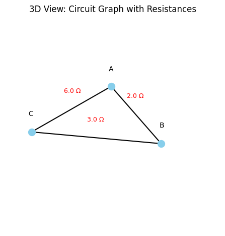
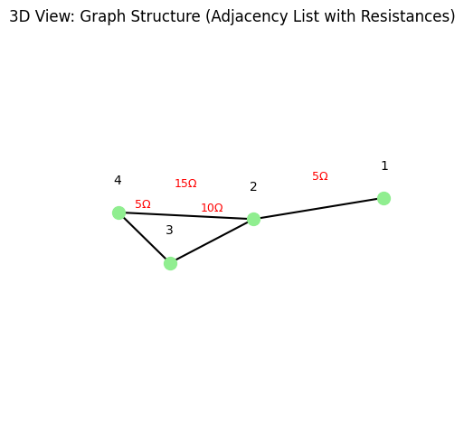
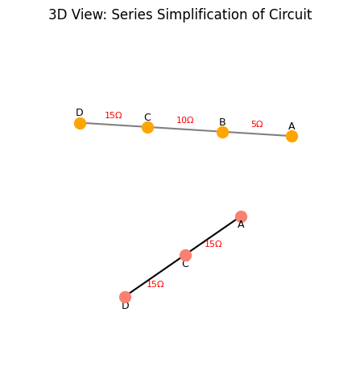

# Problem 1
## 1. Graph Representation of the Circuit

Modeling electrical circuits using graph theory provides a structured way to analyze even the most complex configurations. In this representation, we treat:

- **Nodes** as electrical junctions.
- **Edges** as resistors.
- **Weights** on edges as resistance values in ohms $(\Omega)$.

---

### 1.1 Nodes and Edges

Let the circuit be represented by a graph $G = (V, E)$, where:
- $V$ is the set of nodes, $V = \{v_1, v_2, \dots, v_n\}$.
- $E$ is the set of edges, where each edge $e_{ij} \in E$ connects two nodes $v_i$ and $v_j$ and carries a resistance $R_{ij} > 0$.

Each resistor is an edge:
$$
e_{ij} = (v_i, v_j, R_{ij})
$$

---

### 1.2 Adjacency Matrix

Define the **adjacency matrix** $A$ of the graph such that:
$$
A_{ij} = 
\begin{cases}
\frac{1}{R_{ij}}, & \text{if } e_{ij} \in E \\
0, & \text{otherwise}
\end{cases}
$$

This matrix encodes the **conductance** (inverse of resistance) between nodes.

---

### 1.3 Resistance as Edge Weights

The resistance between two nodes $v_i$ and $v_j$ is represented by the weight of the edge $e_{ij}$:
$$
w(e_{ij}) = R_{ij}
$$

Weights are strictly positive:
$$
\forall e_{ij} \in E, \quad R_{ij} \in \mathbb{R}^+, \quad R_{ij} > 0
$$

---

### 1.4 Multiple Edges and Parallel Resistors

If multiple resistors connect the same pair of nodes (i.e., **parallel resistors**), they are represented by **multiple edges** or combined into one with equivalent resistance:

$$
\frac{1}{R_{\text{eq}}} = \sum_{k=1}^{m} \frac{1}{R_k}, \quad \text{for } m \text{ resistors in parallel}
$$

---

### 1.5 Directed vs Undirected Graphs

Circuits are modeled using **undirected graphs**:
$$
e_{ij} = e_{ji}
$$

Because resistance is symmetric: $R_{ij} = R_{ji}$.

---

### 1.6 Example: Simple Triangle Circuit

Given a triangle circuit with three nodes and three resistors:

- Nodes: $V = \{A, B, C\}$
- Edges:
  - $R_{AB} = 2\ \Omega$
  - $R_{BC} = 3\ \Omega$
  - $R_{CA} = 4\ \Omega$

Graphically:
- $e_{AB} = (A, B, 2)$
- $e_{BC} = (B, C, 3)$
- $e_{CA} = (C, A, 4)$

Then:
$$
A = \begin{bmatrix}
0 & \frac{1}{2} & \frac{1}{4} \\
\frac{1}{2} & 0 & \frac{1}{3} \\
\frac{1}{4} & \frac{1}{3} & 0
\end{bmatrix}
$$

---

### 1.7 Summary

Graph-theoretic modeling allows:

- Systematic abstraction of circuit elements.
- Encoding resistances as edge weights.
- Laying the foundation for automated simplification and analysis using algorithms.

---

## 2. Definition of the Problem

The goal is to compute the **equivalent resistance** between two specific nodes in an electrical network: the **START** and **END** nodes. These nodes serve as the terminals across which a voltage is applied or current flows.

---

### 2.1 Problem Statement

Given:
- A connected, weighted, undirected graph $G = (V, E)$.
- Each edge $e_{ij} \in E$ has a weight $R_{ij} > 0$ representing resistance in ohms.
- Two distinguished nodes: $\text{START} = v_s$ and $\text{END} = v_t$.

**Objective**: Determine the **total equivalent resistance** $R_{\text{eq}}(v_s, v_t)$ between node $v_s$ and node $v_t$.

---

### 2.2 Physical Interpretation

If a voltage source $V$ is applied between START and END, and the resulting current is $I$, then the equivalent resistance is:
$$
R_{\text{eq}} = \frac{V}{I}
$$

In this context, $R_{\text{eq}}$ encapsulates the effect of all possible paths and resistor configurations between the two nodes.

---

### 2.3 Electrical Law Basis

The computation respects **Ohm's Law** and **Kirchhoff's Laws**:

- **Ohm’s Law**:
  $$
  V = IR
  $$

- **Kirchhoff’s Current Law (KCL)**:
  $$
  \sum I_{\text{in}} = \sum I_{\text{out}} \quad \text{(at each node)}
  $$

- **Kirchhoff’s Voltage Law (KVL)**:
  $$
  \sum_{\text{loop}} V = 0
  $$

These laws constrain how voltages and currents behave across the network and define the effective resistance between terminals.

---

### 2.4 Path Considerations

All possible current paths between START and END contribute to the total current. The resistance is affected by:

- **Series connections**: resistances add.
  $$
  R_{\text{eq}} = R_1 + R_2 + \cdots + R_n
  $$

- **Parallel connections**: conductances add.
  $$
  \frac{1}{R_{\text{eq}}} = \frac{1}{R_1} + \frac{1}{R_2} + \cdots + \frac{1}{R_n}
  $$

The algorithm must detect and handle these patterns in arbitrary arrangements.

---

### 2.5 Graph-Based Reformulation

In graph-theoretic terms:
- START and END are fixed nodes $v_s, v_t \in V$.
- Determine an effective edge weight $R_{\text{eq}}(v_s, v_t)$ that represents the aggregate resistance of the entire graph between those two nodes.

This involves simplifying the graph iteratively until only a single edge between $v_s$ and $v_t$ remains:
$$
G \rightarrow G' \quad \text{where} \quad G' = \{v_s, v_t, R_{\text{eq}}\}
$$

---

### 2.6 Applications

- Power distribution analysis
- Circuit optimization and simplification
- Preprocessing for SPICE-like simulators
- Educational tools for visualizing electrical behavior

---

### 2.7 Summary

To solve the problem:
- Identify START ($v_s$) and END ($v_t$).
- Represent the circuit as a graph $G = (V, E)$ with resistances as edge weights.
- Use electrical and graph-theoretical laws to reduce the network.
- Output the scalar value $R_{\text{eq}}(v_s, v_t)$ representing the total resistance between the two terminals.

---

## 3. Graph Traversal and Pattern Recognition

To compute equivalent resistance in a circuit graph, the system must identify structural patterns that correspond to **series**, **parallel**, and **complex** resistor arrangements. This section outlines how to detect these configurations using graph traversal and pattern recognition techniques.

---

### 3.1 Series Connections (Linear Chains)

**Definition**: A series connection occurs when two or more resistors are connected end-to-end, with no branching paths between them.

#### Graph Condition:
If node $v_i$ has exactly two neighbors $v_{i-1}$ and $v_{i+1}$ and is not START or END, then $v_i$ is part of a **linear chain**:
$$
\deg(v_i) = 2, \quad v_i \notin \{\text{START}, \text{END}\}
$$

#### Series Reduction Formula:
If resistors $R_1$ and $R_2$ are in series:
$$
R_{\text{eq}} = R_1 + R_2
$$

#### Graph Simplification:
Replace two edges $(v_{i-1}, v_i, R_1)$ and $(v_i, v_{i+1}, R_2)$ with a single edge:
$$
(v_{i-1}, v_{i+1}, R_{\text{eq}})
$$

Remove $v_i$ from the graph:
$$
V \leftarrow V \setminus \{v_i\}
$$

---

### 3.2 Parallel Connections (Multiple Paths)

**Definition**: Resistors are in parallel if they connect the same pair of nodes via multiple independent paths.

#### Graph Condition:
If multiple edges exist between the same pair of nodes $v_i$ and $v_j$:
$$
\exists\, \{e_1, e_2, \dots, e_n\} \subset E \quad \text{such that} \quad \forall k,\, e_k = (v_i, v_j, R_k)
$$

#### Parallel Reduction Formula:
The equivalent resistance of $n$ parallel resistors is:
$$
\frac{1}{R_{\text{eq}}} = \sum_{k=1}^{n} \frac{1}{R_k}
$$

#### Graph Simplification:
Replace all $n$ edges with a single edge $(v_i, v_j, R_{\text{eq}})$.

---

### 3.3 Identifying Cycles (Complex Topologies)

**Definition**: A **cycle** is a closed loop in the graph where the current can circulate in more than one direction.

#### Graph Condition:
A **cycle** exists if a **Depth-First Search (DFS)** or **Breadth-First Search (BFS)** encounters a visited node that is not its parent:
$$
\text{DFS}(v) \rightarrow \text{back edge} \Rightarrow \text{cycle}
$$

Cycles often correspond to:
- Multiple series/parallel combinations
- Bridges and mesh circuits

#### Cycle Detection Algorithm:
Use DFS to identify cycles:
1. Mark all nodes as unvisited.
2. Start DFS from START node.
3. If DFS revisits a node that is not the immediate parent, a cycle exists.

---

### 3.4 Handling Complex Subgraphs

Once cycles are found:
- Try **series and parallel simplification** locally within the cycle.
- Use **graph contraction** or **Y-Δ (star-delta)** transformations if needed.

---

### 3.5 Summary

Graph traversal techniques enable the recognition of key resistor arrangements:

- **Series**: Linear chains (nodes with degree 2).
- **Parallel**: Multiple edges between two nodes.
- **Cycles**: Detected using DFS or BFS; may require advanced simplifications.

These patterns are critical for recursively reducing the graph into a single equivalent resistance between START and END.

---

## 4. Graph Simplification Rules

Once series, parallel, and cyclic patterns have been identified in the circuit graph, we apply **graph simplification rules** to reduce the network into a simpler equivalent form. This process is repeated iteratively until only a single equivalent resistor remains between the START and END nodes.

---

### 4.1 Series Simplification

**Condition**:
Node $v$ connects exactly two neighbors $u$ and $w$:
$$
\deg(v) = 2, \quad v \notin \{\text{START}, \text{END}\}
$$

**Edges**:
- $e_{uv} = (u, v, R_1)$
- $e_{vw} = (v, w, R_2)$

**Action**:
Replace with one edge:
$$
e_{uw} = (u, w, R_1 + R_2)
$$

**Remove node** $v$ and both edges $e_{uv}$, $e_{vw}$ from the graph.

---

### 4.2 Parallel Simplification

**Condition**:
Multiple edges between the same pair of nodes:
$$
e_1 = (u, v, R_1), \quad e_2 = (u, v, R_2), \quad \dots
$$

**Action**:
Combine into one edge:
$$
\frac{1}{R_{\text{eq}}} = \sum_{k=1}^{n} \frac{1}{R_k}
$$

Replace with:
$$
e_{\text{eq}} = (u, v, R_{\text{eq}})
$$

---

### 4.3 Self-loops

**Condition**:
An edge connects a node to itself:
$$
e = (v, v, R)
$$

**Action**:
Remove. Self-loops do not contribute to paths between START and END.

---

### 4.4 Cycles and Complex Topologies

**Condition**:
A subgraph contains a closed loop or mesh.

**Actions**:
- Attempt local **series/parallel** simplification inside the cycle.
- If the cycle is not reducible via series/parallel, apply:
  - **Δ–Y (Delta–Wye) Transformations**
  - **Y–Δ (Wye–Delta) Transformations**

These allow conversion between triangle and star configurations:
- Delta to Wye:
  $$
  R_a = \frac{R_{ab} R_{ac}}{R_{ab} + R_{bc} + R_{ca}}, \quad \text{(and similarly for } R_b, R_c\text{)}
  $$
- Wye to Delta:
  $$
  R_{ab} = \frac{R_a + R_b + R_a R_b / R_c}
  $$

---

### 4.5 Node Merging

When two nodes are connected by a simplified edge and no other connections, **merge** them:
- Replace both with a single new node.
- Update all incident edges accordingly.

This step simplifies the structure and prepares for the next reduction iteration.

---

### 4.6 Termination Condition

Simplification is complete when the graph contains only two nodes:
$$
V = \{\text{START}, \text{END}\}
$$

And one edge:
$$
E = \{(\text{START}, \text{END}, R_{\text{eq}})\}
$$

---

### 4.7 Summary

These simplification rules allow the reduction of arbitrarily complex resistor networks. By combining physical laws and graph operations, we can transform the circuit graph step-by-step until the equivalent resistance between START and END is explicitly computed.

---

## 5. Path and Connectivity Analysis

Before and during simplification, it's essential to analyze the **connectivity** of the circuit graph. Ensuring that all possible **paths between START and END** are accounted for is critical to preserving the electrical integrity of the network and guaranteeing correct computation of equivalent resistance.

---

### 5.1 Path Enumeration Between START and END

To fully capture the circuit behavior, we must identify all paths that allow current to flow from the START node $v_s$ to the END node $v_t$.

#### Algorithms for Path Discovery:
- **Depth-First Search (DFS)**:
  - Recursively explores all branches.
  - Effective for detecting cycles and nested paths.
- **Breadth-First Search (BFS)**:
  - Explores shortest paths first.
  - Useful for level-based reduction.

#### Multiple Paths:
If more than one path exists between $v_s$ and $v_t$, those paths may represent **parallel** resistor configurations.

---

### 5.2 Maintaining Connectivity During Simplification

When reducing the circuit, it's essential that the simplification:
- **Preserves the number of paths** between $v_s$ and $v_t$.
- **Does not disconnect** any components of the circuit relevant to current flow.
- **Respects bridge and articulation points**, which are critical for connectivity.

#### Rule of Preservation:
Let $G$ be the original graph and $G'$ be the simplified graph. Then:
$$
\text{Paths}_{G}(v_s \to v_t) \cong \text{Paths}_{G'}(v_s \to v_t)
$$

Where $\cong$ indicates equivalence in path logic (though not necessarily in count).

---

### 5.3 Bridge and Articulation Detection

A **bridge** (or cut-edge) is an edge whose removal disconnects the graph:
- Must not be removed prematurely.
- Usually part of a **series** connection.

An **articulation point** is a node whose removal increases the number of connected components:
- Often a junction in **nested or branching** configurations.

Use DFS to identify such components:
- Maintain a discovery time and low-link value for each node.

---

### 5.4 Connectivity Constraints in Simplification

When applying series or parallel rules:
- Ensure that merging or removing nodes/edges does not affect the existence of a valid $v_s$–$v_t$ path.
- Avoid collapsing nodes or edges that are **critical** to overall connectivity.

---

### 5.5 Dynamic Path Verification

After each simplification step:
- Optionally recompute the number of $v_s$–$v_t$ paths to verify integrity.
- Use:
  - **Path counting algorithms** (e.g., DFS with memoization)
  - **Connectivity checks** using `networkx.is_connected()` (if using Python)

---

### 5.6 Connectivity-Aware Reduction

A safe approach is to:
1. Detect and reduce **safe series/parallel patterns**.
2. Re-check connectivity from START to END.
3. Repeat until no further simplification is possible without altering critical paths.

---

### 5.7 Summary

Connectivity analysis ensures:
- All contributing paths to current flow are respected.
- Simplifications do not invalidate the topology.
- The algorithm maintains logical and electrical correctness throughout reduction.

Preserving correct path structure is just as important as computing resistance values.

---

## ✅ 6. Input Handling

```python
import networkx as nx
import matplotlib.pyplot as plt
from mpl_toolkits.mplot3d import Axes3D

# Sample input: list of edges (node1, node2, resistance)
edge_list = [
    ('A', 'B', 2.0),
    ('B', 'C', 3.0),
    ('A', 'C', 6.0)
]
start_node = 'A'
end_node = 'C'

# Create the graph and add edges with resistance values
G = nx.Graph()
for u, v, r in edge_list:
    if r < 0:
        raise ValueError("Resistance must be non-negative.")
    G.add_edge(u, v, resistance=r)

# Check if there is a path between start and end nodes
if not nx.has_path(G, start_node, end_node):
    raise ValueError("Graph is not connected between START and END nodes.")

# Generate 3D positions for each node using spring layout (z = 0)
pos_2d = nx.spring_layout(G, seed=42)
pos_3d = {node: (x, y, 0) for node, (x, y) in pos_2d.items()}

# Set up the 3D plot
fig = plt.figure()
ax = fig.add_subplot(111, projection='3d')

# Plot each node
for node, (x, y, z) in pos_3d.items():
    ax.scatter(x, y, z, color='skyblue', s=100)
    ax.text(x, y, z + 0.02, node, fontsize=10, ha='center')

# Plot each edge and display resistance labels
for u, v, data in G.edges(data=True):
    x_vals = [pos_3d[u][0], pos_3d[v][0]]
    y_vals = [pos_3d[u][1], pos_3d[v][1]]
    z_vals = [pos_3d[u][2], pos_3d[v][2]]
    ax.plot(x_vals, y_vals, z_vals, color='black')

    # Midpoint for resistance label
    mid_x = (x_vals[0] + x_vals[1]) / 2
    mid_y = (y_vals[0] + y_vals[1]) / 2
    mid_z = (z_vals[0] + z_vals[1]) / 2
    ax.text(mid_x, mid_y, mid_z + 0.02, f"{data['resistance']} Ω", fontsize=9, color='red', ha='center')

# Set plot title and hide axes
ax.set_title("3D View: Circuit Graph with Resistances")
ax.set_axis_off()

plt.tight_layout()
plt.show()
```

---

## ✅ 7. Data Structures

```python
import networkx as nx
import matplotlib.pyplot as plt
from mpl_toolkits.mplot3d import Axes3D

# Create the graph and add edges with resistance attributes
G = nx.Graph()
G.add_edge('1', '2', resistance=5)
G.add_edge('2', '3', resistance=10)
G.add_edge('3', '4', resistance=5)
G.add_edge('2', '4', resistance=15)

# Generate 2D spring layout and project into 3D (z = 0)
pos_2d = nx.spring_layout(G, seed=42)
pos_3d = {node: (x, y, 0) for node, (x, y) in pos_2d.items()}

# Set up a 3D plot
fig = plt.figure()
ax = fig.add_subplot(111, projection='3d')

# Plot the graph nodes
for node, (x, y, z) in pos_3d.items():
    ax.scatter(x, y, z, color='lightgreen', s=100)
    ax.text(x, y, z + 0.02, node, fontsize=10, ha='center')

# Plot the edges and resistance labels
for u, v, data in G.edges(data=True):
    x_vals = [pos_3d[u][0], pos_3d[v][0]]
    y_vals = [pos_3d[u][1], pos_3d[v][1]]
    z_vals = [pos_3d[u][2], pos_3d[v][2]]
    ax.plot(x_vals, y_vals, z_vals, color='black')

    # Add resistance label at the midpoint of each edge
    mid_x = (x_vals[0] + x_vals[1]) / 2
    mid_y = (y_vals[0] + y_vals[1]) / 2
    mid_z = (z_vals[0] + z_vals[1]) / 2
    ax.text(mid_x, mid_y, mid_z + 0.02, f"{data['resistance']}Ω", fontsize=9, color='red', ha='center')

# Set plot title and hide axes
ax.set_title("3D View: Graph Structure (Adjacency List with Resistances)")
ax.set_axis_off()

plt.tight_layout()
plt.show()
```

---

## ✅ 8. Resistance Calculation (Series Simplification Example)

```python
import networkx as nx
import matplotlib.pyplot as plt
from mpl_toolkits.mplot3d import Axes3D
import numpy as np

# Function to simplify series connections in a graph
def simplify_series(G, start_node, end_node):
    simplified = G.copy()
    for node in list(G.nodes):
        if node in (start_node, end_node):
            continue
        if G.degree[node] == 2:
            neighbors = list(G.neighbors(node))
            if simplified.has_edge(neighbors[0], node) and simplified.has_edge(node, neighbors[1]):
                r1 = G[node][neighbors[0]]['resistance']
                r2 = G[node][neighbors[1]]['resistance']
                new_r = r1 + r2
                simplified.add_edge(neighbors[0], neighbors[1], resistance=new_r)
                simplified.remove_node(node)
    return simplified

# Define the original graph with resistors
G = nx.Graph()
start_node = 'A'
end_node = 'D'
G.add_edge('A', 'B', resistance=5)
G.add_edge('B', 'C', resistance=10)
G.add_edge('C', 'D', resistance=15)

# Simplify the graph
G_simplified = simplify_series(G, start_node, end_node)

# Get 2D positions for layout and project into 3D layers
pos_before_2d = nx.spring_layout(G, seed=42)
pos_after_2d = nx.spring_layout(G_simplified, seed=42)
pos_before_3d = {node: (x, y, 0.2) for node, (x, y) in pos_before_2d.items()}  # Top layer
pos_after_3d = {node: (x, y, -0.2) for node, (x, y) in pos_after_2d.items()}   # Bottom layer

# Create the 3D figure
fig = plt.figure()
ax = fig.add_subplot(111, projection='3d')

# Plot the original circuit (before simplification)
for node, (x, y, z) in pos_before_3d.items():
    ax.scatter(x, y, z, color='orange', s=100)
    ax.text(x, y, z + 0.02, node, fontsize=9, ha='center')

for u, v, data in G.edges(data=True):
    x_vals = [pos_before_3d[u][0], pos_before_3d[v][0]]
    y_vals = [pos_before_3d[u][1], pos_before_3d[v][1]]
    z_vals = [pos_before_3d[u][2], pos_before_3d[v][2]]
    ax.plot(x_vals, y_vals, z_vals, color='gray')
    mid_x, mid_y, mid_z = np.mean(x_vals), np.mean(y_vals), np.mean(z_vals)
    ax.text(mid_x, mid_y, mid_z + 0.02, f"{data['resistance']}Ω", fontsize=8, color='red', ha='center')

# Plot the simplified circuit (after simplification)
for node, (x, y, z) in pos_after_3d.items():
    ax.scatter(x, y, z, color='salmon', s=100)
    ax.text(x, y, z - 0.04, node, fontsize=9, ha='center')

for u, v, data in G_simplified.edges(data=True):
    x_vals = [pos_after_3d[u][0], pos_after_3d[v][0]]
    y_vals = [pos_after_3d[u][1], pos_after_3d[v][1]]
    z_vals = [pos_after_3d[u][2], pos_after_3d[v][2]]
    ax.plot(x_vals, y_vals, z_vals, color='black')
    mid_x, mid_y, mid_z = np.mean(x_vals), np.mean(y_vals), np.mean(z_vals)
    ax.text(mid_x, mid_y, mid_z - 0.04, f"{data['resistance']}Ω", fontsize=8, color='red', ha='center')

# Set title and remove axes
ax.set_title("3D View: Series Simplification of Circuit")
ax.set_axis_off()

plt.tight_layout()
plt.show()
```

---

## 9. Test Cases

Robust testing is essential to verify that the graph-based resistance computation is correct across different circuit configurations. This section outlines a structured approach for selecting and designing test cases.

---

### 9.1 Simple Series Configuration

**Circuit**:
- $R_1 = 2\ \Omega$
- $R_2 = 3\ \Omega$
- $R_3 = 5\ \Omega$ (in series)

**Expected Result**:
$$
R_{\text{eq}} = R_1 + R_2 + R_3 = 10\ \Omega
$$

**Graph**:
- Nodes: $A \to B \to C \to D$
- Edges: $(A, B, 2),\ (B, C, 3),\ (C, D, 5)$

---

### 9.2 Simple Parallel Configuration

**Circuit**:
- $R_1 = 4\ \Omega$
- $R_2 = 6\ \Omega$ (in parallel)

**Expected Result**:
$$
\frac{1}{R_{\text{eq}}} = \frac{1}{R_1} + \frac{1}{R_2} = \frac{1}{4} + \frac{1}{6} = \frac{5}{12} \Rightarrow R_{\text{eq}} = 2.4\ \Omega
$$

**Graph**:
- Nodes: $A \leftrightarrow B$ with two parallel edges

---

### 9.3 Nested Configuration

**Circuit**:
- Series of two branches:
  - Branch 1: $R = 3\ \Omega$
  - Branch 2: parallel: $R_1 = 2\ \Omega$, $R_2 = 6\ \Omega$

**Expected Result**:
$$
\frac{1}{R_{\text{branch2}}} = \frac{1}{2} + \frac{1}{6} = \frac{2}{3}, \quad R_{\text{branch2}} = 1.5\ \Omega \\
R_{\text{eq}} = 3 + 1.5 = 4.5\ \Omega
$$

---

### 9.4 Complex Graph with Cycles

**Circuit**:
A triangle of resistors:
- $R_{AB} = 2\ \Omega$
- $R_{BC} = 3\ \Omega$
- $R_{CA} = 4\ \Omega$

**Expected Result**:
Use either mesh analysis or Δ–Y transformation to compute:
$$
R_{\text{eq}}(A, B) = \text{Non-trivial result (approx. 2.545)}
$$

**Purpose**:
Test cycle detection and advanced reduction logic.

---

### 9.5 Stress Test: Random Mesh Network

- Generate a random graph with:
  - 6–10 nodes
  - Random resistance values between 1–10 $\Omega$
- Ensure START and END are connected
- Use brute-force or Kirchhoff-based numerical solver for comparison

---

## 10. Validation

Validation confirms that the algorithm yields correct and consistent results. It ensures not only correct numerical outputs but also structural integrity throughout graph simplification.

---

### 10.1 Known-Result Verification

- Each test case has a mathematically known expected result.
- Compare:
  $$
  R_{\text{computed}} \approx R_{\text{expected}}
  $$
- Use relative or absolute error threshold:
  $$
  \left| \frac{R_{\text{computed}} - R_{\text{expected}}}{R_{\text{expected}}} \right| < \epsilon
  $$

Typical $\epsilon$ threshold: $10^{-5}$

---

### 10.2 Preservation of START–END Path

After each simplification step:
- Confirm START and END are still connected:
  $$
  \text{has\_path}(G', \text{START}, \text{END}) = \text{True}
  $$
- No isolated subgraphs should remain between START and END.

---

### 10.3 Intermediate Visualization

- Plot intermediate graphs (before/after simplification)
- Annotate edge resistances and simplified patterns
- Visually inspect that:
  - Only safe transformations occurred
  - No accidental merges or removals affecting key connectivity

---

### 10.4 Consistency under Graph Isomorphism

Reordering nodes or edges in the input graph should not change the result:
- Test equivalent graphs with shuffled labels or edge order
- Validate:
  $$
  R_{\text{eq}}^{(G_1)} = R_{\text{eq}}^{(G_2)}
  $$

---

### 10.5 Summary

Testing and validation are critical to:
- Catch edge cases in simplification logic
- Ensure numerical and structural correctness
- Build confidence that the algorithm generalizes across a wide variety of circuit topologies


