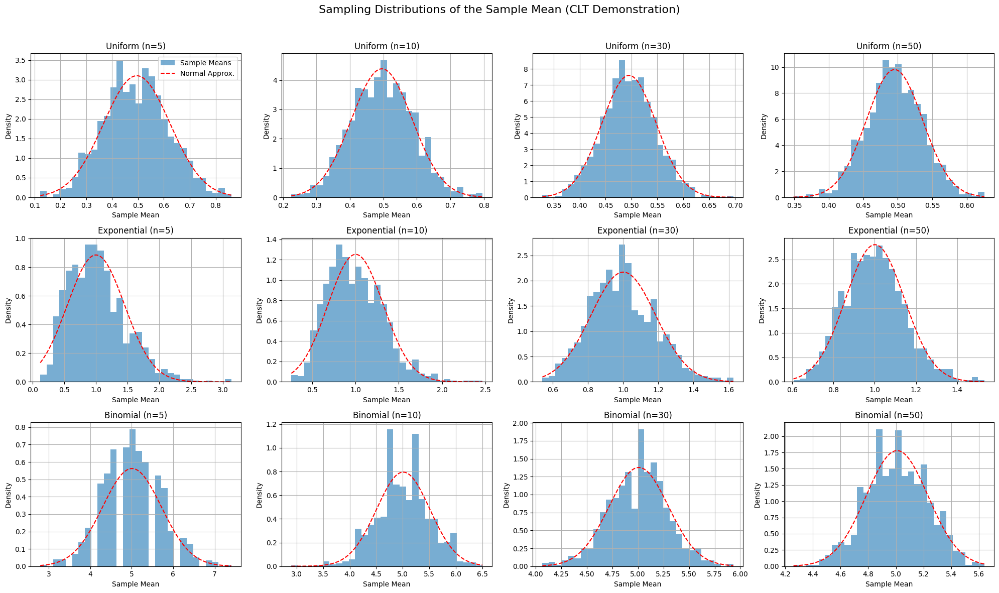

# Problem 1
In this section, we explore the foundational population distributions that will be used to demonstrate the Central Limit Theorem (CLT). The three chosen distributions are:

- **Uniform Distribution**
- **Exponential Distribution**
- **Binomial Distribution**

A synthetic population of size $N = 10{,}000$ will be generated for each distribution using random number generation techniques.

---

### 📘 Uniform Distribution

The continuous uniform distribution over the interval $[a, b]$ is defined by the probability density function (PDF):

$$
f(x) = 
\begin{cases}
\frac{1}{b - a} & \text{for } a \le x \le b \\
0 & \text{otherwise}
\end{cases}
$$

For simulation purposes, we choose:
- $a = 0$
- $b = 1$

So:

$$
f(x) = 1 \quad \text{for } 0 \le x \le 1
$$

**Mean and variance** of a uniform distribution:

$$
\mu = \frac{a + b}{2}, \quad \sigma^2 = \frac{(b - a)^2}{12}
$$

---

### 📘 Exponential Distribution

The exponential distribution models the time between events in a Poisson process and has the PDF:

$$
f(x; \lambda) = 
\begin{cases}
\lambda e^{-\lambda x} & \text{for } x \ge 0 \\
0 & \text{otherwise}
\end{cases}
$$

We use $\lambda = 1$ in the simulations.

**Mean and variance**:

$$
\mu = \frac{1}{\lambda}, \quad \sigma^2 = \frac{1}{\lambda^2}
$$

For $\lambda = 1$, we get:

$$
\mu = 1, \quad \sigma^2 = 1
$$

---

### 📘 Binomial Distribution

The binomial distribution models the number of successes in $n$ independent Bernoulli trials with success probability $p$. The probability mass function (PMF) is:

$$
P(X = k) = \binom{n}{k} p^k (1 - p)^{n - k}, \quad k = 0, 1, ..., n
$$

We use:
- $n = 10$
- $p = 0.5$

**Mean and variance**:

$$
\mu = np, \quad \sigma^2 = np(1 - p)
$$

For our parameters:

$$
\mu = 5, \quad \sigma^2 = 2.5
$$

---

### 🔢 Simulation Plan

- Generate $N = 10{,}000$ samples from each distribution.
- Validate empirical means and variances against theoretical values.
- Use this data for downstream sampling and CLT visualization.

---

## 2. Perform Sampling & Compute Sample Means

This section outlines the process of constructing sampling distributions of the sample mean, which is the empirical basis for demonstrating the Central Limit Theorem (CLT).

---

### 🧮 Sampling Strategy

We define a set of sample sizes:

$$
n \in \{5, 10, 30, 50\}
$$

For each population distribution (Uniform, Exponential, Binomial), and for each sample size $n$, the following steps are performed:

---

### 🔁 Iterative Sampling Process

Let $N = 10{,}000$ be the size of the population dataset, and $R = 1{,}000$ the number of repeated samples.

For each iteration $r = 1, 2, ..., R$:

1. Draw a simple random sample:
   $$
   \{X_1^{(r)}, X_2^{(r)}, \dots, X_n^{(r)}\} \sim \text{Population}
   $$

2. Compute the sample mean:
   $$
   \bar{X}^{(r)} = \frac{1}{n} \sum_{i=1}^{n} X_i^{(r)}
   $$

3. Store $\bar{X}^{(r)}$ for analysis.

After $R$ repetitions, we obtain a **sampling distribution** of the sample mean:

$$
\{\bar{X}^{(1)}, \bar{X}^{(2)}, \dots, \bar{X}^{(R)}\}
$$

---

### 📈 Theoretical Expectation

According to the Central Limit Theorem, for sufficiently large $n$:

$$
\bar{X} \sim \mathcal{N}\left( \mu, \frac{\sigma^2}{n} \right)
$$

Where:
- $\mu$ is the population mean
- $\sigma^2$ is the population variance

As $n$ increases, the sampling distribution of $\bar{X}$ becomes approximately normal, **regardless of the population's shape**.

---

### 💾 Data Collection Summary

- **Input:** Population data of size $N = 10{,}000$
- **Output:** Sampling distributions of sample means
- **Storage:** One distribution of 1,000 means per ($\text{distribution}$, $n$) pair

This systematic approach allows us to **empirically demonstrate** the CLT across various conditions.

---

## 3. Visualize Sampling Distributions

The goal of this section is to **empirically observe the Central Limit Theorem (CLT)** in action by visualizing the sampling distributions of the sample mean across different population types and sample sizes.

---

### 🎯 Objectives

- Create histograms of sample means drawn from:
  - **Uniform**
  - **Exponential**
  - **Binomial**
- Compare how the shape of the sampling distribution changes as the sample size increases.
- Overlay a theoretical **normal distribution** to visualize convergence.

---

### 📐 Theoretical Background

According to the CLT, for a population with mean $\mu$ and finite variance $\sigma^2$, the distribution of the sample mean $\bar{X}$ approaches a normal distribution as the sample size $n$ increases:

$$
\bar{X} \sim \mathcal{N} \left( \mu, \frac{\sigma^2}{n} \right)
$$

This holds regardless of the shape of the original population distribution, provided $n$ is sufficiently large and the samples are independent.

---

### 🧪 Simulation Parameters

- **Population size:** $10{,}000$
- **Sample sizes:** $n \in \{5, 10, 30, 50\}$
- **Repetitions per configuration:** $1{,}000$
- **Distributions used:**
  - Uniform$(0,1)$
  - Exponential$(\lambda=1)$
  - Binomial$(n=10, p=0.5)$

---

### 📊 Python Code: All Sampling Distributions in a Single Figure

```python
import numpy as np
import matplotlib.pyplot as plt
from scipy.stats import norm

# Settings
distributions = {
    'Uniform': np.random.uniform(0, 1, 10_000),
    'Exponential': np.random.exponential(scale=1.0, size=10_000),
    'Binomial': np.random.binomial(n=10, p=0.5, size=10_000)
}

sample_sizes = [5, 10, 30, 50]
repeats = 1000

# Setup subplot grid
fig, axes = plt.subplots(nrows=3, ncols=4, figsize=(20, 12))
fig.suptitle('Sampling Distributions of the Sample Mean (CLT Demonstration)', fontsize=16)

# Iterate through distributions and sample sizes
for row_idx, (dist_name, population) in enumerate(distributions.items()):
    for col_idx, n in enumerate(sample_sizes):
        ax = axes[row_idx, col_idx]
        
        # Generate sample means
        sample_means = [np.mean(np.random.choice(population, size=n, replace=False)) for _ in range(repeats)]
        
        # Histogram
        ax.hist(sample_means, bins=30, density=True, alpha=0.6, label='Sample Means')
        
        # Overlay Normal Curve
        mu = np.mean(population)
        sigma = np.std(population) / np.sqrt(n)
        x = np.linspace(min(sample_means), max(sample_means), 200)
        ax.plot(x, norm.pdf(x, mu, sigma), 'r--', label='Normal Approx.')
        
        # Titles and labels
        ax.set_title(f'{dist_name} (n={n})')
        ax.set_xlabel('Sample Mean')
        ax.set_ylabel('Density')
        ax.grid(True)
        if row_idx == 0 and col_idx == 0:
            ax.legend()

# Adjust layout
plt.tight_layout(rect=[0, 0, 1, 0.96])  # Leave space for the main title
plt.show()
```

---

### 🔍 Interpretation

* As $n$ increases, the sampling distributions become **increasingly bell-shaped**, closely approximating the normal distribution.
* The effect is more dramatic for skewed populations (e.g., exponential), confirming that the **CLT compensates for non-normality** through sample aggregation.
* The overlaid normal curves demonstrate the expected theoretical behavior:

  * Mean $\mu$ is preserved.
  * Variance shrinks by a factor of $\frac{1}{n}$.

---

## 4. Analyze Convergence Behavior

This section investigates the dynamics of convergence in sampling distributions of the sample mean. While the Central Limit Theorem (CLT) guarantees asymptotic normality, the **rate of convergence** and the **shape of convergence** depend on key properties of the population distribution.

---

### 📈 Rate of Convergence Toward Normality

Let $\bar{X}_n$ denote the sample mean from a random sample of size $n$:

$$
\bar{X}_n = \frac{1}{n} \sum_{i=1}^{n} X_i
$$

According to the CLT:

$$
\bar{X}_n \xrightarrow{d} \mathcal{N} \left( \mu, \frac{\sigma^2}{n} \right) \quad \text{as } n \to \infty
$$

The **speed** at which $\bar{X}_n$ approaches normality depends on:
- The **skewness** and **kurtosis** of the original distribution
- The **sample size** $n$
- The **variance** $\sigma^2$ of the population

---

### 🧭 Influence of Original Distribution Shape

The shape of the population distribution heavily influences how fast convergence occurs:

| Distribution Type     | Shape Characteristics       | Convergence Speed     |
|-----------------------|-----------------------------|------------------------|
| Uniform$(a, b)$        | Symmetric, bounded          | Fast                  |
| Binomial$(n, p)$       | Discrete, symmetric if $p=0.5$ | Moderate to Fast      |
| Exponential$(\lambda)$ | Positively skewed, unbounded | Slow (needs large $n$) |

For heavily skewed or heavy-tailed distributions (e.g., exponential), larger sample sizes are needed for the sampling distribution to resemble a normal distribution.

---

### 📏 Role of Variance in Spread of Sample Means

The **spread** (standard deviation) of the sampling distribution of the mean decreases as sample size increases:

$$
\text{Var}(\bar{X}_n) = \frac{\sigma^2}{n}
$$

Thus, larger $n$ not only improves normality, but also **reduces uncertainty** in sample-based estimates. The corresponding standard deviation of the sample mean is:

$$
\text{SE}(\bar{X}) = \frac{\sigma}{\sqrt{n}}
$$

This effect is critical in:
- Confidence interval construction
- Hypothesis testing
- Practical estimation scenarios

---

### 🔍 Empirical Indicators of Convergence

In practice, convergence toward normality can be visually and numerically assessed through:
- **Histogram symmetry** and bell-shaped appearance
- **Overlay with a normal density curve**
- **Quantitative metrics** like skewness, kurtosis, or the Shapiro–Wilk test

---

### 📌 Summary

- **CLT convergence is universal** but its **rate is conditional** on the population.
- **Symmetric distributions** converge quickly.
- **Skewed or heavy-tailed distributions** require larger sample sizes.
- The **spread of the sampling distribution shrinks** with $n$, increasing precision in estimation.

This deepens our understanding of **why and how** the CLT justifies statistical inference, even when the data are non-normal.


---

## 5. Discuss Practical Applications

The Central Limit Theorem (CLT) is not merely a theoretical result — it underpins many practical methods across statistics, science, industry, and finance. This section illustrates **how and why the CLT is applied** in real-world scenarios involving uncertainty, estimation, and control.

---

### 🧪 1. Estimating Population Means from Samples

One of the most common applications of the CLT is to estimate the **population mean** $\mu$ using a sample mean $\bar{X}$:

$$
\bar{X} \approx \mathcal{N}\left( \mu, \frac{\sigma^2}{n} \right)
$$

This allows us to:
- Construct **confidence intervals**:

  $$
  \bar{X} \pm z_{\alpha/2} \cdot \frac{s}{\sqrt{n}}
  $$

- Perform **hypothesis testing** on means when the population distribution is unknown.

This is critical in:
- Clinical trials and medical research
- Survey-based population studies
- Polling and social sciences

---

### 🏭 2. Monitoring Quality in Production Systems

In industrial processes, the CLT enables **statistical process control (SPC)** using sample-based metrics:

- Control charts track $\bar{X}$ to detect shifts in process mean.
- Assumes sampling distribution is approximately normal even if measurements are not.

Let $X_1, \dots, X_n$ be measurements per batch. Then:

$$
\bar{X}_{\text{batch}} \sim \mathcal{N}\left( \mu, \frac{\sigma^2}{n} \right)
$$

This is foundational for:
- Six Sigma methodologies
- Manufacturing consistency
- Detecting out-of-control conditions early

---

### 💹 3. Risk and Uncertainty in Financial Modeling

In finance, many models rely on CLT to justify assumptions of **normal returns**, especially over aggregated time periods or portfolios:

- Daily returns $R_t$ may be non-normal, but the sum or average of many returns over time:

  $$
  \bar{R}_n = \frac{1}{n} \sum_{t=1}^{n} R_t
  $$

  tends toward normality due to CLT.

Applications include:
- **Value at Risk (VaR)** models
- **Monte Carlo simulations** of portfolio behavior
- **Central limit-based pricing** in actuarial models

Even though raw financial data may be skewed or heavy-tailed, the CLT justifies use of Gaussian approximations in aggregated contexts.

---

### 🧠 Broader Perspective

The CLT enables practitioners to:
- Use sample statistics as proxies for unknown population parameters
- Apply parametric tests and confidence intervals even in **non-normal environments**
- Reduce complex or irregular distributions into well-understood **normal approximations**

In essence, the CLT acts as a **statistical equalizer**, making inference possible in settings where full knowledge of the underlying distribution is infeasible.

---

### 📌 Conclusion

The Central Limit Theorem is a **foundational pillar of statistical practice**, providing the mathematical justification for:
- Reliable inference
- Predictive modeling
- Operational control

Its importance spans disciplines, reinforcing both the **rigor and reach** of statistical thinking.
