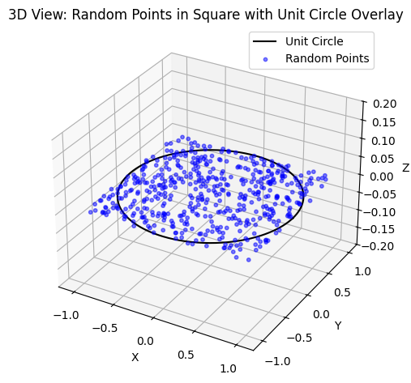
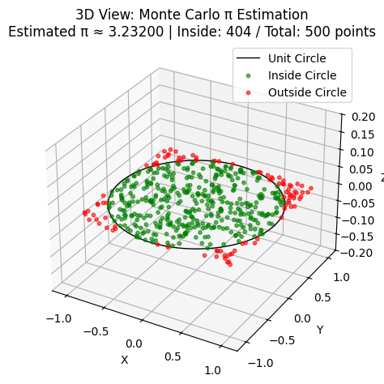
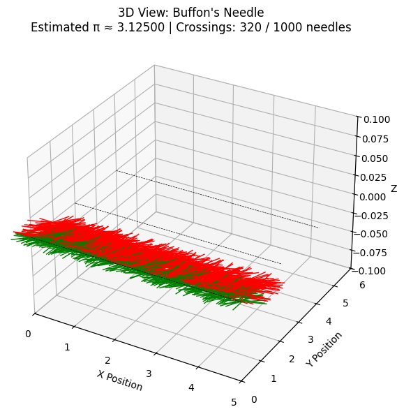

# Problem 2
### 1. Theoretical Foundation

Understanding the estimation of $\pi$ using Monte Carlo methods begins with the geometric relationship between a circle and the square that bounds it.

#### Area Relationship

Consider a circle of radius $r$ inscribed within a square. The square has side length $2r$, so its area is:

$$
A_{\text{square}} = (2r)^2 = 4r^2
$$

The area of the circle is:

$$
A_{\text{circle}} = \pi r^2
$$

The ratio of the circle's area to the square's area is thus:

$$
\frac{A_{\text{circle}}}{A_{\text{square}}} = \frac{\pi r^2}{4r^2} = \frac{\pi}{4}
$$

This geometric insight is the foundation of the Monte Carlo estimation technique for $\pi$.

#### Random Sampling Argument

Now consider a simulation in which we randomly generate $N$ points uniformly within the bounding square. For each point, we can determine whether it lies inside the circle using the Euclidean distance from the origin.

Let $(x_i, y_i)$ be a randomly generated point such that $x_i, y_i \in [-r, r]$. The point lies inside the circle if:

$$
x_i^2 + y_i^2 \leq r^2
$$

Let $N_{\text{circle}}$ denote the number of points that fall inside the circle. Then, the proportion of points that fall within the circle approximates the area ratio:

$$
\frac{N_{\text{circle}}}{N} \approx \frac{A_{\text{circle}}}{A_{\text{square}}} = \frac{\pi}{4}
$$

#### Derivation of the π Estimation Formula

Solving for $\pi$, we multiply both sides by $4$:

$$
\pi \approx 4 \cdot \left( \frac{N_{\text{circle}}}{N} \right)
$$

This yields the core formula used in the circle-based Monte Carlo simulation:

$$
\pi \approx 4 \cdot \left( \frac{\text{points inside circle}}{\text{total points}} \right)
$$

This estimator converges to the true value of $\pi$ as $N \to \infty$ by the Law of Large Numbers. The accuracy of the approximation depends on the number of points sampled and the quality of the random number generator.

### 2. Simulation

Monte Carlo simulation for estimating $\pi$ relies on probabilistic sampling of points in a square and evaluating whether they fall inside a unit circle.

#### Generating Random Points in a Square

To estimate $\pi$ using a circle of radius $r = 1$ centered at the origin $(0, 0)$, we simulate $N$ random points $(x_i, y_i)$ uniformly within the square bounded by $[-1, 1] \times [-1, 1]$.

This can be done using a pseudo-random number generator that produces values uniformly in $[-1, 1]$:

$$
x_i \sim \mathcal{U}(-1, 1), \quad y_i \sim \mathcal{U}(-1, 1), \quad i = 1, 2, \dots, N
$$

#### Determining If a Point Lies Inside the Circle

Each point is checked against the condition for being inside the unit circle of radius $1$:

$$
x_i^2 + y_i^2 \leq 1
$$

If this inequality holds, the point lies within or on the boundary of the circle.

#### Counting Points

Let:

- $N$ be the total number of generated points,
- $N_{\text{circle}}$ be the number of points that satisfy the condition $x_i^2 + y_i^2 \leq 1$.

The algorithm maintains two counters:

- One for total iterations: $N$
- One for hits inside the circle: $N_{\text{circle}}$

#### Estimating π from the Ratio

Since the ratio of the area of the unit circle to the square is $\pi / 4$, we estimate $\pi$ by:

$$
\pi \approx 4 \cdot \left( \frac{N_{\text{circle}}}{N} \right)
$$

As $N \to \infty$, this estimate converges to the true value of $\pi$ with high probability, due to the Law of Large Numbers.

#### Summary of Algorithm

1. Initialize counters:  
   $N_{\text{circle}} = 0$, $N = \text{desired number of samples}$

2. Repeat $N$ times:
   - Generate random $x \in [-1, 1]$
   - Generate random $y \in [-1, 1]$
   - If $x^2 + y^2 \leq 1$, increment $N_{\text{circle}}$

3. Estimate $\pi$ using:

   $$
   \pi \approx 4 \cdot \left( \frac{N_{\text{circle}}}{N} \right)
   $$

This forms the computational core of the Monte Carlo method for $\pi$ estimation.

### 3. Visualization

We visualize the Monte Carlo simulation by plotting the square, the unit circle, and the randomly generated points—distinguishing between those that fall inside and outside the circle.

#### **1. Plotting the Unit Square and Unit Circle**

```python
import numpy as np
import matplotlib.pyplot as plt
from mpl_toolkits.mplot3d import Axes3D

# Create the unit circle using parametric equations
theta = np.linspace(0, 2 * np.pi, 500)
x_circle = np.cos(theta)
y_circle = np.sin(theta)
z_circle = np.zeros_like(theta)  # Flat in the XY plane

# Define square boundary edges (in XY plane, z = 0)
square_edges = [
    ([-1, 1], [-1, -1]),  # bottom edge
    ([1, 1], [-1, 1]),    # right edge
    ([1, -1], [1, 1]),    # top edge
    ([-1, -1], [1, -1])   # left edge
]

# Set up a 3D figure
fig = plt.figure()
ax = fig.add_subplot(111, projection='3d')

# Plot the unit circle
ax.plot(x_circle, y_circle, z_circle, label='Unit Circle', lw=2)

# Plot the square edges
for x_edge, y_edge in square_edges:
    ax.plot(x_edge, y_edge, [0, 0], color='gray', linestyle='--', lw=0.8)

# Set 3D plot limits and labels
ax.set_xlim([-1.2, 1.2])
ax.set_ylim([-1.2, 1.2])
ax.set_zlim([-1.2, 1.2])
ax.set_xlabel('X')
ax.set_ylabel('Y')
ax.set_zlabel('Z')
ax.set_title('3D View: Unit Circle Inscribed in a Square')
ax.legend()

plt.tight_layout()
plt.show()
```

#### **2. Plotting Random Points with Circle Overlay**

```python
import numpy as np
import matplotlib.pyplot as plt
from mpl_toolkits.mplot3d import Axes3D

# Generate random points within the square
N = 500
x_points = np.random.uniform(-1, 1, N)
y_points = np.random.uniform(-1, 1, N)
z_points = np.zeros(N)  # Keep points flat in the XY plane (z = 0)

# Create the unit circle using parametric equations
theta = np.linspace(0, 2 * np.pi, 500)
x_circle = np.cos(theta)
y_circle = np.sin(theta)
z_circle = np.zeros_like(theta)

# Set up a 3D plot
fig = plt.figure()
ax = fig.add_subplot(111, projection='3d')

# Plot the unit circle
ax.plot(x_circle, y_circle, z_circle, color='black', label='Unit Circle')

# Plot the random points
ax.scatter(x_points, y_points, z_points, color='blue', alpha=0.5, s=10, label='Random Points')

# Set axis limits and labels
ax.set_xlim([-1.2, 1.2])
ax.set_ylim([-1.2, 1.2])
ax.set_zlim([-0.2, 0.2])
ax.set_xlabel('X')
ax.set_ylabel('Y')
ax.set_zlabel('Z')
ax.set_title('3D View: Random Points in Square with Unit Circle Overlay')
ax.legend()

plt.tight_layout()
plt.show()
```

#### **3. Distinguishing Inside vs Outside Points**

```python
import numpy as np
import matplotlib.pyplot as plt
from mpl_toolkits.mplot3d import Axes3D

# Parameters
N = 500  # Total number of random points

# Generate random points inside the square [-1, 1] x [-1, 1]
x_points = np.random.uniform(-1, 1, N)
y_points = np.random.uniform(-1, 1, N)
z_points = np.zeros(N)  # Flat in XY plane

# Determine which points fall inside the unit circle
dist_squared = x_points**2 + y_points**2
inside_mask = dist_squared <= 1

# Separate points into inside and outside the circle
x_inside = x_points[inside_mask]
y_inside = y_points[inside_mask]
z_inside = np.zeros_like(x_inside)

x_outside = x_points[~inside_mask]
y_outside = y_points[~inside_mask]
z_outside = np.zeros_like(x_outside)

# Create the unit circle for reference
theta = np.linspace(0, 2 * np.pi, 500)
x_circle = np.cos(theta)
y_circle = np.sin(theta)
z_circle = np.zeros_like(theta)

# Estimate the value of pi
N_inside = np.sum(inside_mask)
pi_estimate = 4 * N_inside / N

# Create a 3D plot
fig = plt.figure()
ax = fig.add_subplot(111, projection='3d')

# Plot the unit circle in the XY plane
ax.plot(x_circle, y_circle, z_circle, color='black', linewidth=1, label='Unit Circle')

# Plot points inside the circle
ax.scatter(x_inside, y_inside, z_inside, color='green', s=10, alpha=0.6, label='Inside Circle')

# Plot points outside the circle
ax.scatter(x_outside, y_outside, z_outside, color='red', s=10, alpha=0.6, label='Outside Circle')

# Set axis limits and labels
ax.set_xlim([-1.2, 1.2])
ax.set_ylim([-1.2, 1.2])
ax.set_zlim([-0.2, 0.2])
ax.set_xlabel('X')
ax.set_ylabel('Y')
ax.set_zlabel('Z')

# Title including estimated π and point statistics
ax.set_title(f"3D View: Monte Carlo π Estimation\nEstimated π ≈ {pi_estimate:.5f} | "
             f"Inside: {N_inside} / Total: {N} points")

ax.legend()
plt.tight_layout()
plt.show()
```

---

### 4. Analysis

The power of the Monte Carlo method lies not just in its simplicity, but in its convergence properties as the number of trials increases. In this section, we empirically analyze how the estimate of $\pi$ improves with additional sampling.

#### Increasing the Number of Samples

To evaluate convergence, we perform the simulation for progressively larger sample sizes:

$$
N \in \{10^2, 10^3, 10^4, 10^5, 10^6\}
$$

For each $N$, we independently generate $N$ random points in the square $[-1, 1] \times [-1, 1]$, and estimate $\pi$ using the formula:

$$
\pi_N = 4 \cdot \left( \frac{N_{\text{circle}}}{N} \right)
$$

where $N_{\text{circle}}$ is the number of points satisfying $x_i^2 + y_i^2 \leq 1$.

#### Estimation Error

We define the absolute error of the estimate for a given $N$ as:

$$
\text{Error}(N) = \left| \pi - \pi_N \right|
$$

where $\pi \approx 3.14159265\ldots$ is the true mathematical constant.

#### Plotting Error vs. Sample Size

A log-log or semi-log plot of $\text{Error}(N)$ versus $N$ provides a visual depiction of convergence. We typically expect:

- A **decreasing error trend** as $N$ increases.
- A convergence rate of approximately $\mathcal{O}(1/\sqrt{N})$ due to the probabilistic nature of the sampling.

Such a plot reveals the inherent **variance** in the estimator and illustrates the **Law of Large Numbers** in practice.

#### Convergence Behavior

As $N \to \infty$, the estimate $\pi_N$ converges to the true value of $\pi$ with probability 1:

$$
\lim_{N \to \infty} \pi_N = \pi \quad \text{(almost surely)}
$$

This is a consequence of the **Strong Law of Large Numbers**, since each point’s contribution is a Bernoulli trial with success probability $\pi / 4$.

Additionally, the **Central Limit Theorem** implies that the distribution of $\pi_N$ becomes increasingly concentrated around $\pi$, with standard deviation proportional to $1/\sqrt{N}$.

#### Runtime Considerations

The computational cost of the method scales linearly with the number of points:

$$
\text{Time Complexity} = \mathcal{O}(N)
$$

Therefore, while the algorithm is trivially parallelizable, improving accuracy requires exponentially more points due to the $1/\sqrt{N}$ convergence.

#### Summary

- Monte Carlo estimation of $\pi$ exhibits **slow convergence**, requiring large $N$ for high precision.
- The **error decreases stochastically**, and smooths out over repeated trials.
- Visualizing error vs. $N$ validates the **statistical convergence theory** and illustrates the trade-off between **accuracy and computational cost**.

This empirical analysis underscores both the strengths and limitations of the Monte Carlo method as a numerical approximation tool.


## **Part 2: Estimating π Using Buffon’s Needle**

### 1. Theoretical Foundation (Buffon’s Needle)

Buffon’s Needle is a classical probability problem with deep historical and mathematical significance. It represents one of the earliest known Monte Carlo methods and offers an elegant probabilistic approach to estimating $\pi$.

#### Experimental Setup

Consider a plane marked with **parallel lines** spaced at a uniform distance $D$ apart. A **needle** of length $L$ is dropped at random onto the plane. The central question is: *What is the probability that the needle will cross one of the lines?*

Let:

- $L$ be the length of the needle,
- $D$ be the distance between adjacent parallel lines,
- $N$ be the total number of needle drops,
- $C$ be the number of drops where the needle crosses a line.

To compute this probability geometrically, we examine the relative orientation and position of the needle.

#### Probabilistic Model

Let the center of the needle fall a distance $y$ from the nearest line (with $0 \leq y \leq D/2$ due to symmetry), and let the needle form an angle $\theta$ with respect to the parallel lines, where $\theta \in [0, \pi/2]$ due to symmetry.

The needle crosses a line if the vertical projection of half its length is greater than $y$:

$$
\frac{L}{2} \sin(\theta) \geq y
$$

To compute the probability of this event, we integrate over the joint distribution of $y$ and $\theta$.

The crossing probability $P$ is given by:

$$
P = \frac{2L}{\pi D}, \quad \text{for } L \leq D
$$

This is derived from integrating the joint uniform distribution of $y$ and $\theta$ over the region satisfying the crossing condition.

#### Estimating π

Rearranging the above expression to solve for $\pi$, we obtain the Monte Carlo estimator:

$$
\pi \approx \frac{2 \cdot L \cdot N}{D \cdot C}
$$

where:

- $L$ is the known needle length,
- $D$ is the known distance between lines,
- $N$ is the number of needle drops,
- $C$ is the number of observed line crossings.

This formulation allows us to estimate $\pi$ using physical or simulated random trials.

#### Geometric Constraints and Assumptions

1. **Needle Length Condition**:  
   The derivation assumes that $L \leq D$. When $L > D$, the calculation of the crossing probability becomes more complex and requires advanced integral calculus.

2. **Uniform Randomness**:  
   - The angle $\theta$ is uniformly distributed in $[0, \pi]$.
   - The center's distance to the nearest line $y$ is uniformly distributed in $[0, D/2]$.

3. **Independence**:  
   Each needle drop is assumed to be independent of the others.

4. **Idealization**:  
   The method assumes infinitely thin lines and infinitely narrow needles. In practice or simulation, these approximations must be handled carefully.

#### Summary

Buffon’s Needle presents a remarkable bridge between geometry and probability, offering a method to estimate $\pi$ from random experiments. The key estimator:

$$
\pi \approx \frac{2 \cdot L \cdot N}{D \cdot C}
$$

is both historically important and pedagogically powerful, illustrating how randomness and geometry can yield deep mathematical constants.

---

### 2. Simulation

The Buffon’s Needle simulation translates the theoretical formulation into a computational experiment. This involves simulating the random placement and orientation of needles on a plane with parallel lines, then using the observed outcomes to estimate $\pi$.

#### Random Needle Placement

Each needle is dropped onto a plane with parallel lines spaced a fixed distance $D$ apart. The needle’s configuration is characterized by two independent random variables:

- **Center position** $y$: The perpendicular distance from the needle's midpoint to the nearest parallel line. Uniformly sampled from the interval:

  $$
  y \sim \mathcal{U}(0, \frac{D}{2})
  $$

- **Angle** $\theta$: The angle between the needle and the parallel lines. Uniformly sampled from:

  $$
  \theta \sim \mathcal{U}(0, \frac{\pi}{2})
  $$

Due to symmetry, it is sufficient to restrict $y$ to $[0, D/2]$ and $\theta$ to $[0, \pi/2]$.

#### Crossing Condition

A needle crosses a line if its vertical projection from the center to an endpoint exceeds the distance $y$:

$$
\frac{L}{2} \cdot \sin(\theta) \geq y
$$

Equivalently, the condition for crossing is:

$$
\text{Crosses if:} \quad y \leq \frac{L}{2} \cdot \sin(\theta)
$$

This condition must be evaluated for each simulated needle drop.

#### Simulation Logic

To estimate $\pi$, we perform the following procedure:

1. **Initialize counters**:
   - Let $N$ be the total number of needle drops.
   - Let $C$ be the number of drops where the needle crosses a line.

2. **Repeat $N$ times**:
   - Sample $y \sim \mathcal{U}(0, D/2)$.
   - Sample $\theta \sim \mathcal{U}(0, \pi/2)$.
   - If $y \leq (L/2) \cdot \sin(\theta)$, increment the crossing counter $C$.

3. **Estimate $\pi$** using:

   $$
   \pi \approx \frac{2 \cdot L \cdot N}{D \cdot C}
   $$

This Monte Carlo estimator becomes increasingly accurate as $N$ grows, assuming $L \leq D$.

#### Summary

The Buffon’s Needle simulation captures a geometric-probabilistic process through:

- Uniform sampling of orientation and position.
- Logical evaluation of crossing criteria.
- Aggregation of results to estimate $\pi$.

Despite its simplicity, this simulation highlights the subtle and elegant interplay between randomness and geometry.

---

### 3. Visualization

Visualizing Buffon’s Needle offers intuitive insight into the probabilistic geometry underlying the estimation of $\pi$. By plotting the needle drops over a plane with parallel lines, we can observe which needles intersect the lines and which do not—providing visual confirmation of the crossing condition used in simulation.

#### Needles and Parallel Lines

Each needle has:
- A center point $(x, y)$.
- An orientation given by an angle $\theta \in [0, \pi/2]$.
- A projected vertical span of length $L \cdot \sin(\theta)$.

The needle crosses a line if the vertical distance from its center to the nearest line is less than or equal to half this span:

$$
y \leq \frac{L}{2} \cdot \sin(\theta)
$$

#### Python Code: Needle Visualization with Crossing Indicator

Below is Python code that generates a small number of needles, computes their endpoints, and plots them with distinct colors to indicate whether they cross a line:

```python
import numpy as np
import matplotlib.pyplot as plt
from mpl_toolkits.mplot3d import Axes3D

# Parameters
L = 1.0      # Needle length
D = 2.0      # Distance between parallel lines
N_viz = 1000  # Total number of needles

# Randomly sample needle angles and center positions
theta_v = np.random.uniform(0, np.pi / 2, N_viz)
y_center_v = np.random.uniform(0, D / 2, N_viz)
x_center_v = np.random.uniform(0, 5, N_viz)  # Spread needles along the x-axis

# Calculate the endpoints of each needle
x1 = x_center_v - (L / 2) * np.cos(theta_v)
x2 = x_center_v + (L / 2) * np.cos(theta_v)
y1 = y_center_v - (L / 2) * np.sin(theta_v)
y2 = y_center_v + (L / 2) * np.sin(theta_v)

# Determine which needles cross a line
crosses_v = y_center_v <= (L / 2) * np.sin(theta_v)

# Estimate the value of π
num_crossing = np.sum(crosses_v)
pi_estimate = (2 * L * N_viz) / (D * num_crossing) if num_crossing > 0 else np.nan

# Z-coordinates for 3D view (all needles lie in the XY plane)
z1 = np.zeros_like(x1)
z2 = np.zeros_like(x2)

# Create the 3D plot
fig = plt.figure(figsize=(10, 6))
ax = fig.add_subplot(111, projection='3d')

# Plot each needle in 3D
for i in range(N_viz):
    color = 'green' if crosses_v[i] else 'red'
    ax.plot([x1[i], x2[i]], [y1[i], y2[i]], [z1[i], z2[i]], color=color, linewidth=1)

# Draw horizontal dashed lines spaced by D
x_line = np.linspace(0, 5, 100)
z_line = np.zeros_like(x_line)
for y in np.arange(0, D * 3, D):
    y_line = np.full_like(x_line, y)
    ax.plot(x_line, y_line, z_line, color='black', linestyle='--', linewidth=0.5)

# Set axis labels and limits
ax.set_xlim(0, 5)
ax.set_ylim(0, 3 * D)
ax.set_zlim(-0.1, 0.1)
ax.set_xlabel('X Position')
ax.set_ylabel('Y Position')
ax.set_zlabel('Z')

# Set plot title including π estimate and count details
ax.set_title(f"3D View: Buffon's Needle\nEstimated π ≈ {pi_estimate:.5f} | "
             f"Crossings: {num_crossing} / {N_viz} needles")

plt.tight_layout()
plt.show()
```

#### Interpretation

* **Green needles** represent successful crossings, which increment the crossing count \$C\$ in the \$\pi\$ estimation formula.
* **Red needles** do not intersect any lines and thus are excluded from the numerator.
* The dashed black lines represent the **parallel boundaries** separated by distance \$D\$.

#### Summary

This graphical representation of Buffon’s Needle simulation:

* Provides geometric intuition behind the crossing condition.
* Confirms the uniform random distribution of needle placement and orientation.
* Reinforces the relationship between experimental frequency and the probability-based formula for estimating \$\pi\$:

$$
\pi \approx \frac{2 \cdot L \cdot N}{D \cdot C}
$$

Visualization thus plays a critical role in validating and communicating the Monte Carlo approximation process.

---

### 4. Analysis

The Buffon’s Needle experiment provides a fascinating alternative method for estimating $\pi$, grounded in geometric probability. In this section, we explore how the estimation behaves as the number of needle drops increases.

#### Simulation Setup

To study convergence, we perform simulations for increasing values of $N$, the number of needle drops:

$$
N \in \{10^2, 10^3, 10^4, 10^5, 10^6\}
$$

For each simulation:
- We record the estimated value $\pi_N$ using:

  $$
  \pi_N = \frac{2 \cdot L \cdot N}{D \cdot C}
  $$

  where $C$ is the number of needles that cross a line.

- We compute the absolute error:

  $$
  \text{Error}(N) = \left| \pi - \pi_N \right|
  $$

#### Convergence Behavior

The Buffon’s Needle method converges slowly due to the inherent randomness in the angle and position of each needle. The error decreases roughly at a rate of:

$$
\text{Error}(N) = \mathcal{O}\left( \frac{1}{\sqrt{N}} \right)
$$

This behavior aligns with probabilistic convergence properties such as:

- **Law of Large Numbers**: Ensures that $\pi_N$ converges to $\pi$ almost surely as $N \to \infty$.
- **Central Limit Theorem**: Implies that fluctuations in the estimator's value are normally distributed with variance decreasing as $1/N$.

#### Python Code: Error Tracking and Plotting

```python
import numpy as np
import matplotlib.pyplot as plt

# Constants
L = 1.0
D = 2.0
true_pi = np.pi
sample_sizes = [10**2, 10**3, 10**4, 10**5, 10**6]

pi_estimates = []
errors = []

for N in sample_sizes:
    theta = np.random.uniform(0, np.pi / 2, N)
    y = np.random.uniform(0, D / 2, N)
    C = np.sum(y <= (L / 2) * np.sin(theta))
    
    if C > 0:
        pi_hat = (2 * L * N) / (D * C)
    else:
        pi_hat = np.nan
    
    pi_estimates.append(pi_hat)
    errors.append(abs(true_pi - pi_hat))

# Plot error vs N
plt.figure(figsize=(8, 5))
plt.loglog(sample_sizes, errors, marker='o', label="Absolute Error")
plt.axhline(0, color='gray', linestyle='--', linewidth=0.5)
plt.xlabel("Number of Needle Drops (N)")
plt.ylabel("Absolute Error in π Estimate")
plt.title("Buffon's Needle: Convergence of π Estimation")
plt.grid(True, which="both", ls="--", alpha=0.6)
plt.legend()
plt.show()
```

#### Runtime Considerations

The computational complexity of the simulation is:

$$
\mathcal{O}(N)
$$

Since each trial involves basic arithmetic and trigonometric operations, the method is simple but computationally expensive for high accuracy.

* **Variance** in the estimate is relatively high compared to the circle-based Monte Carlo method.
* **Parallelization** is easy, as each needle drop is independent of the others.

#### Summary

* Buffon’s Needle illustrates a physically inspired stochastic approach to estimating \$\pi\$.
* While conceptually elegant, it converges slowly and requires a large number of samples for precise results.
* Visual and numerical analyses together validate the probabilistic model and reinforce the theoretical prediction:

  $$
  \pi \approx \frac{2 \cdot L \cdot N}{D \cdot C}
  $$

This completes the exploration of \$\pi\$ estimation using Buffon’s Needle.