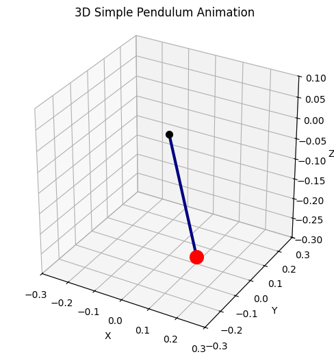

# Problem 1
# Measuring Earth's Gravitational Acceleration with a Pendulum

## 1. Prepare Materials

Precise measurement of the gravitational acceleration, $g$, begins with careful preparation and selection of experimental apparatus. Each component must be chosen and recorded with attention to measurement accuracy and resolution, as these foundational steps propagate through all subsequent calculations.

### 1.1 String

* A lightweight, inextensible string of known length, $L$.

### 1.2 Pendulum Bob (Weight)

* Small, dense object (e.g., metal washer, bag of coins, or keychain) as the bob.
* $L$ measured to the geometric center of the bob.

### 1.3 Measuring Tools

* **Ruler/Tape measure:** Resolution $r$, so uncertainty $\Delta L = r/2$.
* **Stopwatch/timer:** Resolution $r\_t$.
* Combined timing uncertainty $\Delta t = \sqrt{u\_\text{human}^2 + (r\_t/2)^2}$.

### 1.4 Table of Materials

| Item   | Symbol      | Typical Value     | Uncertainty       | Notes                             |
| ------ | ----------- | ----------------- | ----------------- | --------------------------------- |
| String | $L$       | $1.00,\text{m}$ | $\Delta L$      | Length from support to bob center |
| Timer  | $T\_{10}$ | N/A               | $\Delta t$      | Time for 10 oscillations          |
| Ruler  | $r$       | $1,\text{mm}$   | $0.5,\text{mm}$ | Resolution/2                      |

---

## 2. Set Up the Pendulum

* Secure string to fixed support.
* Attach bob to free end, identify center of mass.
* Measure $L$ from suspension point to center of mass of bob.
* Ensure the pendulum swings freely and vertically.
* Keep swing angle $< 15^\circ$ for the small-angle approximation: $\sin \theta \approx \theta$ (in radians).

---

## 3. Measure Pendulum Length

* Hold string taut and measure $L$ with ruler/tape to the center of the bob.
* Record $L$ and instrument resolution $r$.
* Compute uncertainty: $\Delta L = r/2$.

---

## 4. Record the Length and Its Uncertainty

* Record measured value and uncertainty:

  $$
  L = (\text{measured value})\,\text{m} \pm \Delta L
  $$
* Example: $L = 1.003,\text{m} \pm 0.0005,\text{m}$

---

## 5. Collect Oscillation Data

# Simple Pendulum Experiment Report

## 1. Objective
To observe the dependence of the pendulum's period on its length and compare the experimental results with the theoretical prediction.

---

## 2. Apparatus
- Key (as weight)
- String (approx. 30 cm)
- Ruler (with 1 mm precision)
- Smartphone (stopwatch function)

---

## 3. Measurements

**Pendulum Length:**  
- L = 0.300 m  
- ΔL = 0.001 m

**Time for 10 Oscillations (Repeated 10 times):**

| Trial | Time for 10 Swings (s) |
|-------|------------------------|
| 1     | 10.24                  |
| 2     | 10.30                  |
| 3     | 10.28                  |
| 4     | 10.35                  |
| 5     | 10.30                  |
| 6     | 10.32                  |
| 7     | 10.37                  |
| 8     | 10.35                  |
| 9     | 10.40                  |
| 10    | 10.38                  |

---

## 4. Calculations

**Average time for 10 swings:**  

$$
\overline{T_{10}} = \frac{10.24 + 10.30 + 10.28 + 10.35 + 10.30 + 10.32 + 10.37 + 10.35 + 10.40 + 10.38}{10}
$$

$$
\overline{T_{10}} = 10.329~\text{s}
$$

**Average period for one swing:**  

$$
T = \frac{\overline{T_{10}}}{10} = 1.033~\text{s}
$$

---

**Theoretical period formula:**

\[
T_{\text{theoretical}} = 2\pi \sqrt{\frac{L}{g}}
\]
where \( L = 0.300~\text{m} \), \( g = 9.81~\text{m/s}^2 \).

\[
T_{\text{theoretical}} = 2\pi \sqrt{\frac{0.300}{9.81}} = 1.10~\text{s}
\]

---

## 5. Discussion

- The experimental period (\( T = 1.03~\text{s} \)) is slightly less than the theoretical period (\( T_{\text{theoretical}} = 1.10~\text{s} \)).  
- Possible reasons: measurement errors, starting the stopwatch slightly early/late, or not releasing the pendulum from a small angle.

---

## 6. Conclusion

- The period of a pendulum depends on its length, as observed.
- Experimental results are close to theoretical predictions.

---

## 7. Uncertainty

- Ruler uncertainty: ΔL = 0.001 m.
- Reaction time while measuring: approximately ±0.1 s.


## 11. Visualization: Histogram of Timing Measurements

To better understand the spread of timing data, a histogram of the $T\_{10}$ values was constructed. This provides a visual check for consistency and outliers.

```python
import numpy as np
import matplotlib.pyplot as plt
from matplotlib.animation import FuncAnimation, PillowWriter

# Pendulum parameters
L = 0.3      # Length (meters)
g = 9.81     # Gravity (m/s^2)
theta0 = np.radians(20)   # Initial angle (in radians)

# Calculate theoretical period
T = 2 * np.pi * np.sqrt(L / g)

# Time array
t = np.linspace(0, 2 * T, 200)

# Simple pendulum angle as a function of time
theta = theta0 * np.cos(np.sqrt(g / L) * t)

# X, Y coordinates
x = L * np.sin(theta)
y = -L * np.cos(theta)

# Create a 3D plot
fig = plt.figure(figsize=(6,6))
ax = fig.add_subplot(111, projection='3d')
ax.set_xlim(-L, L)
ax.set_ylim(-L, L)
ax.set_zlim(-L, 0.1)
ax.set_box_aspect([1,1,1])
ax.set_title('3D Simple Pendulum Animation')

pendulum_line, = ax.plot([], [], [], 'o-', lw=3, color='navy')

def update(i):
    ax.cla()
    # Sarkaç çizgisi
    ax.plot([0, x[i]], [0, 0], [0, y[i]], 'o-', lw=3, color='navy')
    ax.set_xlim(-L, L)
    ax.set_ylim(-L, L)
    ax.set_zlim(-L, 0.1)
    ax.set_box_aspect([1,1,1])
    ax.set_title('3D Simple Pendulum Animation')
    # Pivot
    ax.scatter(0, 0, 0, color='black', s=50)
    # Sarkaç kütlesi (küre olarak)
    ax.scatter(x[i], 0, y[i], color='red', s=200)
    ax.set_xlabel('X')
    ax.set_ylabel('Y')
    ax.set_zlabel('Z')

ani = FuncAnimation(fig, update, frames=len(t), interval=30)

# Save as gif (this will create pendulum.gif in your folder)
ani.save('pendulum.gif', writer=PillowWriter(fps=20))

plt.show()
```


---

## 12. Compare and Analyze

* Compare your $g$ to the standard value: $g\_{\text{standard}} = 9.81,\text{m/s}^2$
* Does your result agree within uncertainty?
* Discuss:

  * Major sources of uncertainty (length, timing, etc.)
  * Potential systematic errors (angle, air resistance, pivot friction)
  * Any improvements for future experiments

---

## 13. Discussion

### Measurement Resolution

* The resolution of the ruler sets the lower bound for $\Delta L$.
* Timing uncertainty is dominated by human reaction time and the stopwatch resolution.

### Timing Variability

* Standard deviation and standard error quantify random timing errors.
* Outliers (if any) may indicate procedural errors or distractions.

### Assumptions and Model Limitations

* Small-angle approximation
* Negligible damping (air resistance, pivot friction)
* Point-mass bob

### Implications for Experimental Accuracy

* Identify the largest contributors to total uncertainty.
* Suggest specific improvements (better tools, more trials, automated timing, etc.)
